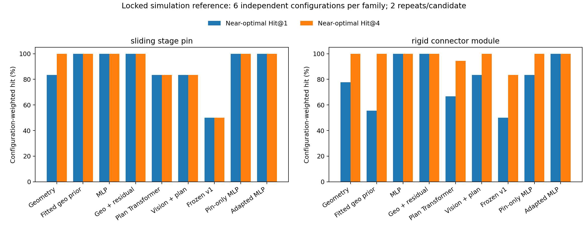
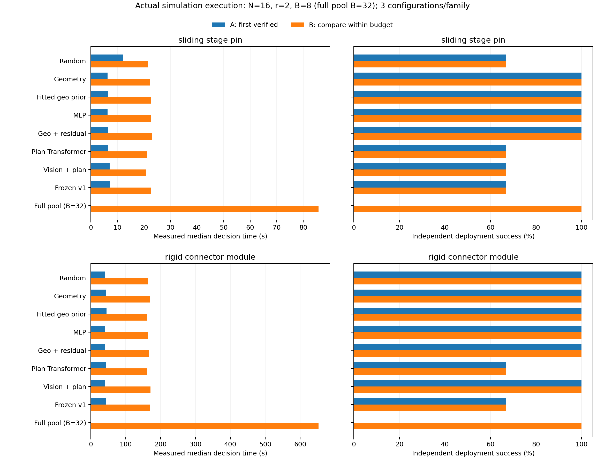
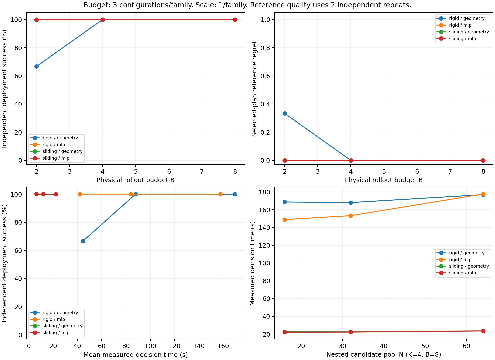

# TwinGraph 下一轮研究原型报告（v2）

## 结论与推荐

本轮形成了可继续扩展的两家族研究原型。当前推荐 **必要几何检查＋几何/计划数值特征 MLP＋显式物理验证预算**。保留单头作为完整任务价值目标；无需扩大视觉模型或重训原子技能。

锁定测试的正向结果：约 7.8k 参数的 MLP 在三个训练种子上均达到配置等权近优 Hit@1=100%，当前几何规则为 80.6%。几何 Hit@2 已达到 100%，因此方法差异主要在小预算、首个候选的位置，不能用饱和的 Top-4 指标证明优势。残差模型同样命中，但没有超过同特征 MLP，故采用更简单的 MLP。

正式主实验中，MLP 与几何规则在两种协议下都通过了 6 个配置的独立部署（每配置两次）。`best_within_budget` 的 B=8 比较中，MLP 平均决策耗时为 90.51 秒、几何为 96.20 秒；选中方案的独立参考次级时间 Regret 分别为 0.255 秒和 1.917 秒。首次验证通过即停时，MLP 平均耗时 24.35 秒、几何 32.93 秒，平均物理验证调用为 2.00 和 2.33 次。两种协议的收益分别计量。

这些是小规模仿真证据。参考率来自每候选两次扰动，100% 命中不构成可靠最优保留保证。

## 实际实现

输入是执行前场景、目标和候选 PlanIR；输出是逐计划的完整任务分数以及完整 Top-K PlanIR。训练标签来自机器人实际执行整段程序的结果。模型不读取候选 ID、排列位置或后续执行标签。对象名称只做绑定，编码与数值特征都根据对象属性/相对位置构建。

MLP 输入 87 维：6 个几何代理特征，以及按执行顺序计算的抓法、力、路线、速度、目标相对位置、形状和此前装配占位特征的统计摘要。先验模型只拟合 6 个几何特征；残差模型在相同 87 维输入上学习修正。两者共享训练/验证权限。Transformer 沿用 128 维、3 层、4 头结构，视觉版使用正确加载且冻结的 ImageNet ResNet-18。

MLP 仍为所有候选计算完整几何代理，不能声称节省了这项开销。无视觉/视觉 Transformer 不计算可选几何排序代理；所有方法保留相同必要路线和契约检查。数值模型运行时不生成自己并不使用的 Transformer token。

### 两种验证模式

| 项目 | first_verified | best_within_budget |
|---|---|---|
| 问题 | 尽快找到验证通过的方案 | 在固定预算中比较方案 |
| 默认重复 | 每候选 r=2 | 每候选 r=2 |
| 接受条件 | 两次至少一次成功 | 同左 |
| 停止 | 首个满足条件的候选 | 候选集合或预算耗尽 |
| 选择 | 首个通过者 | 成功率降序、成功时仿真耗时升序、原排名 |

K 是首批候选数；B 是实际 rollout 数；r 次重复消耗 r 个预算。默认 `allow_expand=False`，不足 r 的尾余预算不启动半个重复块。扩展批次、候选访问与每次重复分别记录。无方案通过时返回“尚无接受方案”，不宣称任务不可行。

训练、在线验证、最终部署、独立参考使用四个不同的扰动命名空间。扰动为摩擦系数 0.85–1.15 倍、执行器增益 0.985–1.015 倍；同配置下候选及排序器配对。最终部署重新运行被选择的 PlanIR，不查缓存成功标签。原 decision.py 的同快照重复执行仅用于 v1 确定性回归。

## 新家族与真实候选

`rigid_connector_module` 使用已经固定的被动壳体、两个独立键控插芯、刚性导向压条和定位销。机器人完整安装四个活动零件；没有声称机器人安装被动壳体。孔/轴尺寸、键方向和配合深度联动生成，未加入柔性线、电气行为或螺纹预紧。

完整计划有 76 个调用。从机器人真实完成一、二、三个零件后的检查点构造 58、40、22 调用的剩余计划，包含重复技能及最后的整体验收。22 调用只出现在测试集，代表“只剩定位销，但已装插芯和压条必须保持合格”的新组合。旧家族程序为 19 调用；v1 的 13 调用程序保持可用。

候选池 16/32/64 使用固定、与标签无关的嵌套抽样；按实际抓法、路线、控制参数和顺序去重。速度、力、路线和抓法的单因素物理检查都有轨迹与反馈记录。不是增加相同执行程序的 ID 来放大池规模。

开发配对试验固定每个零件的抓法，只交换两个插芯顺序：40 mm 间距的两个开发配置均出现“一种顺序完整成功，另一种顺序的释放被已装插芯挡住”。失败记录包含夹爪与已装插芯头部接触。50/45 mm 的早期探测没有该顺序差异，同样保留记录。主分布随后固定为 38–70 mm；已完成的 65–95 mm 宽接口开发数据继续保留。

详见 [顺序干预原始记录](docs/evidence/value_v2/order_intervention.json)、[参数与轨迹检查](docs/evidence/value_v2/physical_checks.json)。这些检查证明场景存在真实后续耦合；尚未单独证明模型增益由哪一种耦合特征造成。

## 数据与划分

v1 的 3,200 次试验、模型和切分没有修改。v2 共 74 个检查点问题组、57 个不同参数化几何、44 个用于聚类统计的 family/seed 单位，包含 **2,368 次新物理标签试验**：前缀全部成功，完整后缀成功 1,484 次。

| 家族/划分 | 问题组 | 种子簇 | 几何配置 | 物理试验 | 完整成功 |
|---|---:|---:|---:|---:|---:|
| 连接器训练 | 32 | 12 | 24 | 1,024 | 731 |
| 连接器验证 | 10 | 4 | 5 | 320 | 222 |
| 连接器测试 | 10 | 6 | 6 | 320 | 181 |
| 滑台销训练 | 12 | 12 | 12 | 384 | 174 |
| 滑台销验证 | 4 | 4 | 4 | 128 | 85 |
| 滑台销测试 | 6 | 6 | 6 | 192 | 91 |

宽/紧间距变体与所有轨迹检查点按 family+seed 留在同一 split，统计时归入同一簇。训练/验证分别有 44/14 个问题组；锁定测试有 16 个问题组、12 个种子簇。开发数据有 2 个全成功组，其余 56 个为混合组；测试 16 组均为混合组。未产生全失败配置组；代码保留这种组，相关无解结束语义已测试，不能声称本轮已测得全失败组的部署表现。

训练种子 17/29/43 用于 MLP 和残差；Transformer 各使用一个种子。主在线模型固定 seed=17，MLP 根据验证集选择第 64 轮。测试标签不参与训练、超参数、候选池或推荐模型选择。数据采集器的两份源码通过显式兼容清单关联，分布变更没有混入不同控制实现。

推荐排序器的预定规则依次比较验证 Hit@4、Regret@4、checkpoint 存储张量元素数和 Brier。这里的存储计数包括缓冲区与共享类中的未启用分支，不是有效参数最小化：几何先验实际只运行 7 个线性参数，却与 MLP 使用相同的 checkpoint 类。先验的验证 Brier 为 0.2019、MLP 为 0.0263；全部比较仍保留先验作为强轻量对照。

## 锁定参考评估

以下按配置簇等权，簇内检查点平均；近优容差 0.1。两次参考扰动只能形成粗经验率。

| 方法 | Hit@1 | Hit@2 | Hit@4 | Regret@1 |
|---|---:|---:|---:|---:|
| 几何规则 | 80.6% | 100.0% | 100.0% | 0.194 |
| 仅拟合几何先验 | 77.8% | 97.2% | 100.0% | 0.222 |
| 数值特征 MLP | 100.0% | 100.0% | 100.0% | 0.000 |
| 几何先验＋学习残差 | 100.0% | 100.0% | 100.0% | 0.000 |
| 无视觉单头 Transformer | 75.0% | 86.1% | 88.9% | 0.250 |
| 视觉＋计划单头 Transformer | 83.3% | 91.7% | 91.7% | 0.167 |
| 固定 v1 单头 | 50.0% | 58.3% | 66.7% | 0.500 |
| 仅旧家族训练的 MLP | 91.7% | 100.0% | 100.0% | 0.083 |
| 少量目标数据适配 MLP | 100.0% | 100.0% | 100.0% | 0.000 |

三个 MLP 种子的 Hit@1 均为 100%，Brier 为 0.0455/0.0431/0.0460；三个残差模型 Hit@1 也均为 100%。视觉 Transformer 在此单种子测试中高于无视觉版，但两者均低于 MLP，尚无依据扩大视觉模型。

### 迁移、适配与长度

- 固定原 v1 单头到新家族：Hit@1=50.0%、Hit@4=83.3%。它同时面临程序协议/参数范围变化，不能把下降全部归因于家族变化。
- 仅用新采集的旧家族数据训练的 MLP，固定权重到新家族：Hit@1=83.3%、Hit@4=100%。这是单独报告的 v2 来源模型迁移。
- 两家族联合训练的 MLP：两家族各自 Hit@1/4 均为 100%，属于联合训练后的新配置测试，不能称为零样本。
- 少样本适配从 pin-only MLP 开始。使用两个目标种子簇，实际覆盖 4 个宽/紧间距几何、12 个检查点组、384 次目标训练标签；另外使用 5 个目标验证几何的 320 次标签。目标家族 Hit@1=100%。不能把这个成本称为“只标注两个配置”。
- 未见的 22 调用剩余计划仅有两个检查点组：几何、MLP、pin-only MLP、适配 MLP 的 Hit@1 均为 2/2；原 v1 为 0/2。样本不足以证明普遍长任务泛化。

完整分层指标包括家族、长度、全成功/混合/全失败及候选经验率是否有差异，见 [分层 CSV](docs/evidence/value_v2/OFFLINE_RANKING_TABLE.csv)。

### 学习具体多选对了什么

几何 Top-1 在连接器 20041/20045、滑台销 21045 的独立参考中失败，MLP Top-1 均通过。部分候选的几何代理分数相同，但较低抓持位置/方向组合导致释放不足，或最终缺少支撑接触。MLP 将实际成功的组合排到前面。

这是计划参数与完整后缀结果之间的关联证据，不是单一特征因果归因。详见 [选错实例](docs/evidence/value_v2/selected_error_cases.json)。几何规则已计入名义已装零件，没有为制造失败移除其信息。

## 实际预算、耗时与部署

### 主比较：同一池、同一验证规则

每家族 3 个独立配置，共 6 个；N=16，K=4，r=2，B=8，禁止扩展。部署每选中方案再用独立扰动执行两次。全池比较单独使用 K=16、B=32。所有方法每个决策使用一个物理 worker；主实验外层并行 6 个配置，方法顺序按预定种子打乱。

以下“决策秒”从初始场景已就绪开始，包含候选生成到物理验证选定方案，停止在最终部署之前。模型/解释器启动、MuJoCo 场景创建和最终部署另列，不隐藏在未说明的缓存中。主表使用常驻模型；全冷启动成本见后文，不能把两种时间范围混用。

| 排序器 | A 部署成功率 | A 平均决策秒 | A 平均验证次数 | B 部署成功率 | B 平均决策秒 |
|---|---:|---:|---:|---:|---:|
| 随机 | 83.3% | 35.78 | 4.33 | 83.3% | 84.12 |
| 几何 | 100% | 32.93 | 2.33 | 100% | 96.20 |
| 拟合几何先验 | 100% | 25.86 | 2.00 | 100% | 91.29 |
| MLP | 100% | 24.35 | 2.00 | 100% | 90.51 |
| 几何＋残差 | 100% | 24.69 | 2.00 | 100% | 94.38 |
| 无视觉 Transformer | 66.7% | 32.88 | 4.00 | 66.7% | 79.20 |
| 视觉 Transformer | 83.3% | 27.25 | 3.00 | 83.3% | 95.02 |
| 固定 v1 | 66.7% | 34.23 | 4.00 | 66.7% | 81.48 |
| 全池验证，B=32 | — | — | — | 100% | 347.29 |

B=8 的各排序器均使用 8 次验证。没有接受方案时，部署成功率记为 0；不会伪造两次未执行的物理 rollout。随机、无视觉、视觉、v1 的预算耗尽且未接受比例分别为 1/6、2/6、1/6、2/6，其余为 0。`budget_fully_spent` 另行记录，避免把正常用完预算与未找到方案混为一谈。

| 主要比较 | 决策中位数 / P95（秒） | 独立参考成功率 Regret | 次级时间 Regret（仿真秒） |
|---|---:|---:|---:|
| 几何 A | 25.10 / 79.38 | 0 | 7.567 |
| MLP A | 23.72 / 43.91 | 0 | 2.518 |
| 几何 B | 95.72 / 170.88 | 0 | 1.917 |
| MLP B | 84.69 / 165.81 | 0 | 0.255 |
| 全池 B=32 | 300.19 / 659.35 | 0 | 0.255 |

次级时间 Regret 只在选中方案参考成功率接近池内最佳时定义，比较成功执行的平均仿真耗时；不能与决策墙钟秒混用。MLP B 与全池本轮部署平均成功执行仿真耗时均为 95.288 秒，几何 B 为 96.932 秒。两个成功结果的平均值相同不是普遍等价保证。

MLP 相对几何的配置配对平均决策节省：A 为 8.58 秒（2,000 次配置 bootstrap 95% 区间 0.37–24.03），B 为 5.70 秒（0.53–13.51）。只有 6 个配置，P95 和 bootstrap 区间均属探索性描述；成功率差的零宽区间不能解释为无误差保证。按家族分层的结果随表提供，不能用家族混合均值推断任一工业任务的耗时。

有限预算相对全池验证的节省是管线收益，几何也享有该收益。MLP B 相对几何 B 的 5.9% 平均决策节省才是本轮相同协议下的增量计时差异；MLP A 为 26.1%。没有用 N/K 代替测量，也没有省略 MLP 需要的完整几何代理。

实际工作量也随所验证的计划变化：几何/MLP 的 A 平均验证步数分别约 130,423/97,548，B 为 408,522/387,952，全池为 1,517,792。B 中 MLP 的验证步数少约 5.0%，与较短的所选候选执行有关，不能把耗时差全部归因于网络推理速度。MLP B 的可选几何代理平均 0.445 秒、数值特征 0.0046 秒、GPU 同步推理 0.0097 秒；几何 B 的代理为 0.463 秒。完整逐项计时包含生成、必要检查、渲染、视觉编码、恢复、后续参数求解和独立执行；参数求解时间作为 rollout 的子项，未重复相加。

拟合几何先验本身已是强对照：A 与 MLP 同为 2 次平均验证，B 的耗时与质量也接近。MLP 的更强证据包括独立锁定测试 Top-1 保留和选中方案次级执行成本；还不能声称相对所有简单模型都有稳健的大幅收益。

### 实际预算与规模曲线

预算曲线另行真实执行，仍为同一批 6 个配置，r=2、N=16、K=B/2；外层 4 个配置 worker，每个决策一个物理 worker。它们是配对重复测量，不增加独立配置数量，也不与主比较重复合并。

| B / K | 几何配置部署成功 | MLP 配置部署成功 | 几何平均决策秒 | MLP 平均决策秒 |
|---|---:|---:|---:|---:|
| 2 / 1 | 5/6 | 6/6 | 25.47 | 24.19 |
| 4 / 2 | 6/6 | 6/6 | 49.91 | 47.92 |
| 8 / 4 | 6/6 | 6/6 | 95.97 | 90.03 |

最紧预算 B=2 的差异来自连接器 20041：几何首选两次在线验证均未通过，因无扩展预算而未接受方案；MLP 首选通过后又完成两次独立部署。同预算下 MLP 多解决了一个配置。增加到 B=4 后几何也能找到可用方案。这里首先支持成功率维度的小预算收益；更大预算仍可能找到执行更短的方案，不能只凭成功率相同断言所有质量维度相同。

这是预先声明的预算表征，不据此把线上默认预算改为 B=2。下一轮若要自适应选择预算，应在新开发/验证集上制定规则，再锁定测试。只有 6 个配置，不将 6/6 解释为部署保证。

规模实验每家族一个额外配置（20044/21044），固定 K=4、B=8，使用嵌套 N=16/32/64。所有 12 个决策均接受方案并在两次独立部署中成功，真实决策秒如下：

| 家族 / 排序器 | N=16 | N=32 | N=64 |
|---|---:|---:|---:|
| 连接器 / 几何 | 168.73 | 168.07 | 176.91 |
| 连接器 / MLP | 148.86 | 153.33 | 177.65 |
| 滑台销 / 几何 | 22.56 | 22.94 | 23.65 |
| 滑台销 / MLP | 22.17 | 22.31 | 23.61 |

大池下仍可执行，但 N=64 时没有继续扩大 MLP 的计时优势。不能依据一个配置推断增长复杂度。N=32/64 缺少完整独立参考，相关近优和 Regret 字段留空。

连接器的 16/32/64 池分别覆盖 9/13/15 种初始抓法分支及两个结构顺序分支；原始抽样数为 16/32/64。滑台销原始抽样为 16/33/107，去重后为 16/32/64，覆盖 6/7/8 种抓法分支和一个结构分支。两例的必要检查未发现已知冲突，所有候选的后续连续执行约束仍标为 unresolved；“可物化”不等于已证明可执行成功。

## 成本、复现与产物

最终完整回归 **79 passed in 51.31s**。正式表有 150 个决策：主比较 102、预算曲线 36、规模曲线 12；共 982 次在线验证和 274 次实际部署，合计 **1,256 次物理 rollout、60,200,180 个仿真步**。未接受方案没有虚构部署调用，超时数为 0。所有排序器共享同一输入池和成对扰动，150 行 CSV 已与原始执行记录逐项核对。

新配置 seed=30000 的 N=32、K=4、B=8、r=2 接口验收使用最终 MLP：8 次验证后选中的完整 76 调用计划在独立部署中 **2/2 成功**。常驻决策 161.163 秒，另有场景创建 1.079 秒、两次部署共 37.002 秒。完整 [Top-K PlanIR 与溯源](docs/evidence/value_v2/new_configuration/top_k_with_provenance.json)、[输入](docs/evidence/value_v2/new_configuration/inputs.json)和[执行记录](docs/evidence/value_v2/new_configuration/decision.json)均保存。这个接口验收不混入正式测试统计；较早一次相同 seed 的接口运行也保留在归档中，未当成新的独立样本。

### 离线与启动成本

| 成本项 | 标签试验数 | 实测成本 |
|---|---:|---:|
| 训练数据采集 | 1,408 | 19,695.08 worker-wall 秒 |
| 验证数据采集 | 448 | 5,752.55 worker-wall 秒 |
| 独立参考采集 | 512 | 5,505.97 worker-wall 秒 |
| 全部 11 个模型训练 | — | 620.60 墙钟秒 |
| 推荐 MLP 单次训练 | — | 24.64 墙钟秒，其中优化与验证 1.54 秒 |

采集时间是各采集 worker 的墙钟时间之和，不是并行运行的整机耗时或严格 CPU 时间。渲染包含在采集时间中；首次视觉缓存编码没有单独计时，不补造该数值。离线实验和参考标签成本不混入在线决策时间。MLP 使用全部开发数据的标签成本远大于网络优化本身，不能只用“训练秒数 / 每次节省”宣称很快摊销；本轮不报告可推广的摊销次数。

每种方法另起三个新 Python 进程测量启动，OS 文件缓存不清空；包括导入、CUDA 初始化、加载、合成输入预热及进程关闭，不包含场景和物理 rollout。中位数为：随机 2.409 秒、几何 2.340 秒、拟合先验 2.919 秒、MLP 2.939 秒、残差 2.859 秒、无视觉 Transformer 3.213 秒、视觉版 4.233 秒、固定 v1 4.356 秒。它们描述当前统一框架的进程启动，不是重新实现一套最小几何程序的理论开销。

补计场景创建后，主 B 比较的几何/MLP 平均“造景＋决策”为 97.22/91.50 秒；再加两次独立部署为 119.10/113.00 秒。它们是记录项之和，未包含解释器启动与进程关闭。严格区分场景已就绪的决策成本、全过程记录项和冷进程启动。

### 发布位置与溯源

- [数据、完整执行记录与源码归档](datasets/value/README_v2.md)，其中 v1 归档保持原样；v2 使用独立 manifest 和文件名。
- [11 个实际 checkpoint、split 和训练历史](models/value/v2/README.md)；推荐 [best_value_v2.pt](models/value/best_value_v2.pt)。
- [逐决策 EXPERIMENT_TABLE.csv](EXPERIMENT_TABLE.csv)、[配置配对区间](docs/evidence/value_v2/paired_intervals.json)、[完整证据索引](docs/evidence/value_v2/README.md)。
- 运行时实现冻结提交 `304f6e0a3b9084eac195e1e57ef1acc07d64750b`。发布脚本/文档在此之后更新，精确源码字节以 `source_hashes_v2.json` 和源码归档为准。
- 推荐权重 SHA-256：`2d1b73af8d31e70aad10de1dc7c6d493aca154509addb13409d433b8216f8459`。
- 正式在线实现 SHA-256：`f247709daba293143fc972a5b2cbb1349c1090024065905f5642476e7e02f0ea`。
- 宽接口/当前采集源码、每个问题组输入、每个模型和发布文件的哈希分别保存在数据兼容清单、split/manifest 和 [发布校验和](docs/evidence/value_v2/release_checksums.json)中。

所有物理采集、训练和部署使用已授权服务器及原有解释器，未新增算力。绘图使用本地已有 Matplotlib 环境，图像与源指标的哈希经过核对。服务器目录保留断点与原始结果，本地研究分支保存可下载的发布产物。

运行命令与输入输出说明见 [运行指南](docs/value-v2-running.md)，验证协议见 [预先固定的协议](docs/value-v2-protocol.md)，相邻工作与贡献边界见 [RELATED_WORK_DELTA.md](RELATED_WORK_DELTA.md)。

## 本轮迭代记录

| 假设/问题 | 实际行动 | 证据与下一行动 |
|---|---|---|
| 初版新场景支撑验收失败 | 修正活动体局部原点相对支撑肩的位置 | 保留支撑契约；两个开发配置 6/8 完整成功 |
| 宽接口阶段之间过于独立 | 配对改变间距和合法顺序 | 40 mm 两配置出现真实已装件阻挡；保留宽接口数据 |
| K=4 容易饱和 | 明确 A/B 协议，增加 B=2/4/8 | 以独立部署和实测耗时检验小预算收益 |
| 大网络可能没有必要 | 同特征 MLP、几何先验、残差与视觉消融 | MLP 三种子均保持 Top-1 质量，采用简单方案 |
| 候选变化可能未进入控制 | 单参数轨迹/反馈检查与嵌套去重 | 参数确实改变执行；继续扩大真实几何与结构分支 |

## 完成程度与下一轮边界

**已完成**：保留 v1 模型/数据/接口；明确 A/B 验证语义及预算测试；新连接器家族四零件完整物理装配；真实检查点和 16/32/64 嵌套候选；两家族物理标签与锁定划分；几何、拟合先验、MLP、残差、视觉消融和固定 v1 比较；固定来源模型跨家族测试与单独的适配成本；实际独立部署、计时、可恢复运行和完整 Top-K 导出。测试及正式决策条数见上方发布记录。

**有初步证据**：小模型比名义几何更常把成功方案排在首位；在固定验证协议下减少实际验证工作量，并在紧预算中避免部分无接受方案；B 的成功率优先、时间次优规则可选出更短的完整执行方案。直接 MLP 已足以获得当前证据，残差未显示额外优势。

**尚未完成**：更多独立工业资产/几何簇、足够重复的可靠参考率、全失败配置部署统计、超过两个未见长度检查点的泛化、可归因的顺序/释放特征消融、所有模型的多训练种子在线验证，以及真实机器人与感知误差验证。32/64 池有真实执行和成本记录，尚无完整池参考标签；没有测试 128/256。未比较组内排序/Top-K 专用损失或分支多样性机制，本轮先锁定概率监督与等额重复分配的可归因结果。

当前数值摘要保留阶段参数、先后装配占位及首末阶段，不保证区分任意中间程序重排。当前机器人资产沿用以指垫为主的功能接触模型，精确物体位姿来自仿真器；不能据此推断真实夹爪或工业现场的安全性与成功率。候选池内较优也不等于全局最优。

下一轮应先用新的开发几何进行“去掉已装占位特征/只保留局部几何”的单项消融，再预先锁定新测试配置和至少三个在线模型种子。对所有排序器按相同固定规则增加独立参考重复，扩大当前存在释放、支撑和顺序差异的真实任务；预算选择仍在验证集完成。这样可以检验本轮增益是否来自可迁移的后续执行依赖，而不是再次围绕已经公开的测试集调整。
