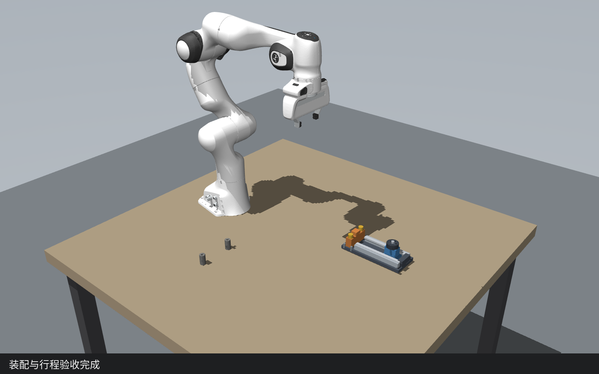

# TwinGraph

基于 MuJoCo 与 Franka Panda 的桌面装配研究项目，探索**面向后续任务的终态价值**与**有限数字孪生预算下的候选计划筛选**。

## 当前可运行内容

- 手动直线滑台装配：滑块沿轨插入、端挡与双销安装、约 100 mm 往复检查、手柄安装。大方桌与被动零件，只有 Panda 的 9 个执行器。
- 独立组件演示：方块、障碍物、单孔插销座和短导轨；显示检测球、坐标轴、计划/实际轨迹和真实接触点。固定镜头与底部字幕，没有网页前端。
- 插销模仿学习：训练代码与可直接运行的行为克隆权重随仓库提供。
- 结构契约验证：检查对象绑定、夹爪资源与规划数据依赖；尚不等于整链几何可行性证明。

执行层保留 **30 个兼容组件**，以少量参数化执行接口、规划生成器、检查器和组合模板组织。抬升、下降、回位和退出复用原控制器；抓取与搬运保留多种绑定候选，执行器和图谱共用声明式契约。详见 [架构设计](docs/architecture.md)。当前采用几何启动排序；VLM、完整任务 Top-k 孪生调度和终态价值网络尚待实现。



## 查看成品

- [完整滑台装配视频](docs/demos/assembly.mp4)
- [小方块连续抓取](docs/demos/cube_grasp.mp4)
- [检测目标球](docs/demos/skills/observe_parts.mp4) · [避障规划轨迹](docs/demos/skills/plan_transfer.mp4)
- [全部独立组件视频索引](docs/demos/INDEX.md)

仓库只保存这一套精选成品。中间录像、运行日志、训练数据和缓存放在被忽略的 `results/` 中。

## 运行

推荐 Python 3.10。在仓库根目录运行：

```bash
python -m pip install -r requirements.txt
export MUJOCO_GL=egl
python -m pytest simbench/tests -q
python -m simbench.assembly.candidate_demo --out results/candidate_demo
python -m simbench.assembly.task --record --out results/tabletop/assembly
```

默认使用仓库内的 `simbench/assembly/checkpoints/insert_bc.pt`，无需先生成旧场景或下载旧模型。Ubuntu 无头录制需要可用的 EGL/OpenGL 驱动及 Noto CJK 字体；详见 [运行指南](docs/setup.md)。

## 文档

| 文档 | 内容 |
|---|---|
| [架构设计](docs/architecture.md) | 技能粒度、规划多解、条件图与当前边界 |
| [滑台任务](docs/tabletop.md) | 产品结构、流程、控制与评估 |
| [独立演示](docs/standalone-skills.md) | 专用场景、可视化与重录 |
| [价值模块设计](docs/value-module.md) | 价值定义、反事实采样、训练与 Top-k 评估 |
| [清理记录](docs/maintenance.md) | 移除的旧代码与保留范围 |

验证记录见 [docs/evidence](docs/evidence)。仓库精选录像保留自接口整理前，不能当成本轮候选排序的新录像。历史小样本结果为完整装配扰动测试 8/8、插销策略新起点测试 12/12，适用条件写在任务文档中；它们不是现实机器人或新价值模块的性能成绩。

本轮接口整理回归：31 项测试、30 个独立组件执行、种子 0 完整装配（108 次调用）、种子 1/19 扰动装配、同初态两种抓取前缀均通过；另重录抬升组件确认字幕和轨迹显示。详见 [本轮验证记录](docs/evidence/interface-refactor/README.md)。
