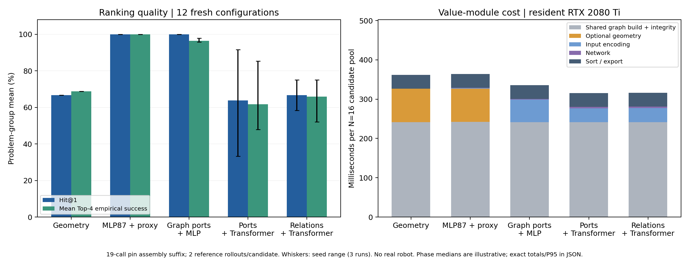

# 技能图输入价值模块：滑台销装配验证结果

## 结论

已打通“技能接口 → 可执行图 → 价值输入 → Top-K → 同一 PlanIR 物理执行”。
验证集预先选定的方案是 **port_mlp_29**，使用图中自动生成的类型化端口输入，
不计算几何排序代理。新测试集 Hit@1/2/4 均为 100.0%（12 个配置）。
当前证据支持统一图输入和浅层 MLP 评分；**不支持关系注意力已经带来增益**。

## 实验与数据

- 新采集 32 个配置 × 16 个真实候选 × 2 次配对扰动 = 1024 次物理试验。
- 28 个训练配置（旧12＋新16，896次）、8 个验证配置（旧4＋新4，256次）、12 个全新测试配置（384次）。
- 新数据整段成功 506/1024，前缀成功 1024/1024，超时 0。
- 任务为滑台销安装完整后缀，19 次调用；不是整台滑台装配或真实机器人实验。
- 训练/验证选完 checkpoint 和方案后才打开新测试；全部试验保留，未过滤全成功／全失败组。
- 候选差异包括抓取方向、高度、搬运净空、夹持力和保护下降速度，均来自实际执行参数。

## 模块结果

| 方法 | Hit@1 | Hit@2 | Hit@4 | Top-4平均经验成功率 | 模块中位/P95(ms) | 共享图准备后评分(ms) |
|---|---:|---:|---:|---:|---:|---:|
| geometry | 66.7% | 91.7% | 100.0% | 68.8% | 363.3 / 372.4 | 120.0 |
| mlp_17 | 100.0% | 100.0% | 100.0% | 100.0% | 364.6 / 374.9 | 122.3 |
| field_17 | 66.7% | 83.3% | 91.7% | 68.8% | 335.8 / 405.7 | 94.3 |
| sequence_17 | 91.7% | 91.7% | 100.0% | 85.4% | 316.2 / 353.9 | 74.6 |
| graph_17 | 66.7% | 75.0% | 91.7% | 70.8% | 316.3 / 317.6 | 74.6 |
| port_mlp_29 | 100.0% | 100.0% | 100.0% | 95.8% | 334.9 / 336.3 | 93.5 |

Hit@K：Top-K 中至少一个方案达到池内经验最佳值减 0.1；不表示 K 个全部成功。
每候选只有两次参考执行，经验率粗。12/12 的组级 Wilson 95% 区间约为
75.8%–100%，不能写成可靠保证。

- port_mlp: Hit@1 均值 100.0%，Hit@4 均值 100.0%，Top-4 平均质量 96.5%。
- sequence: Hit@1 均值 63.9%，Hit@4 均值 94.4%，Top-4 平均质量 61.8%。
- graph: Hit@1 均值 66.7%，Hit@4 均值 91.7%，Top-4 平均质量 66.0%。

几何规则与图端口 MLP 的 Hit@4 都已饱和；改善主要体现在第一名和前四名整体质量。
原 MLP87 仍是强基线：其 Top-4 平均质量和概率校准更好。选定端口 MLP 的
Brier=0.246，MLP87=0.046，应优先把新模型分数用于排序，
不能当作已经校准的成功概率。

## 耗时口径

- 同一 RTX 2080 Ti 主机；模型常驻并预热；同步 CUDA；每个配置重复测量5次，先取组内中位，再跨12组报中位/P95。
- 模块总时间包含：图构建、一致性检查、可选几何评分、输入编码、推理、Top-K排序导出。
- 表最后一列扣除了所有方法共有的图构建和一致性检查，便于看到评分本身的代价。
- 不包含场景搭建、候选必要几何检查、物理验证、渲染；本轮模型不使用图像。原始分项全部保存。
- 选定端口 MLP 相比几何规则的模块中位耗时差为节省 28.4 ms。该小幅收益不是端到端机器人加速比。
- 只在本次候选池内复用相同端口值；无跨请求特征/成功标签缓存。数值输入不变性有回归测试。
- 冷加载记录仅是权重载入，未声称是完整进程冷启动。`scoring_top_k.json` 单独保存实际CLI首调用；首次推理的延迟不等于表中的预热耗时。

## 独立执行

固定测试种子41200–41203；Top-4、总在线预算8、每候选重复2次；比较规则完全相同。
选中方案在另一个 `deployment` 扰动命名空间执行，未使用参考标签决定最终选择。

- geometry: 8/8 独立部署试验成功；4 个问题组；在线验证 32 次。
- mlp_17: 8/8 独立部署试验成功；4 个问题组；在线验证 32 次。
- port_mlp_29: 8/8 独立部署试验成功；4 个问题组；在线验证 32 次。

这是仿真中的独立部署，统计单位仍只有4个问题组；不能把重复试验视作独立配置。

## 模型和输入

选定模型输入维数 12525，由训练图的端口词表自动生成（每个键24个通用数值通道＋1个计数），
隐藏层64、32，单个成功倾向输出。参数量 803777。
图关系模型和无关系控制均为64维、2层、4头，调用内端口注意力汇聚；仅图模型加入有向状态依赖偏置。
字段序列控制也为64维/2层，不是旧128维视觉模型原封不动复现。
具体端口来源、状态版本和结构图见 [设计说明](docs/value-v3-design.md)。

## 已完成／初步证据／未完成

**已完成**：共享接口、图编译、执行一致性、完整Top-K、92项回归测试、新物理数据、11个最终模型、
3种子对照、冻结测试、真实模块计时、独立执行、checkpoint及源码/数据哈希。

**有初步证据**：图接口输入的端口 MLP 能在此任务保持高Top-K保留质量，免去可选几何代理，
并取得表中实测成本差。输入选择可以追溯到执行接口，无需手写产品特征表。

**尚未完成**：完整滑台多零件、真实剩余检查点训练、未见长度/顺序组合物理泛化、视觉收益、
跨家族固定权重迁移及真实机器人验证。当前19步拓扑基本固定，正确依赖边并没有表现出可靠额外价值。
移除/打乱边的诊断结果和所有种子均已公开，不能只挑有利的一行。

下一轮应在保持此测试作回归的前提下，加入真实多零件/重新抓持检查点，使同一接口下的状态来源发生
有意义变化；预留新配置测试，再检验关系模型。优先扩大任务组合与数据覆盖，而不是扩大视觉网络。

## 复现与工件

- [运行命令](docs/value-v3-running.md)；[预先协议与开发修订](docs/value-v3-protocol.md)。
- [完整实验表](EXPERIMENT_TABLE_VALUE_GRAPH.csv)；[完整Top-K](docs/evidence/value_v3/selected_top_k.json)。
- 最佳图输入checkpoint：`models/value/v3/best_graph_input.pt`（port_mlp_29）。
- SHA256：`4ec01eb45e7669a57c7e987395a4c9f23c211f9e1ab3a3d0efcb6639854d21b4`。
- 训练期代码基线：`41fceb1`；模型各自记录训练源码与split哈希。精确历史源码包已与全部训练／采集记录的 SHA256 核对一致。
- 新数据、执行记录、开发历史、源码包与全部哈希：`datasets/value/manifest_skill_graph_v3.json`。
- 环境：Torch 2.1.0+cu121，MuJoCo 2.3.2，NumPy 1.26.4。

PIGINet已研究计划/图像/目标/初态可行性预测及求解时间，参见
[原论文](https://roboticsproceedings.org/rss19/p061.html)。本轮是共享执行接口输入的验证原型，
不把工业场景、Transformer或关系偏置本身当成已经成立的新方法贡献。
