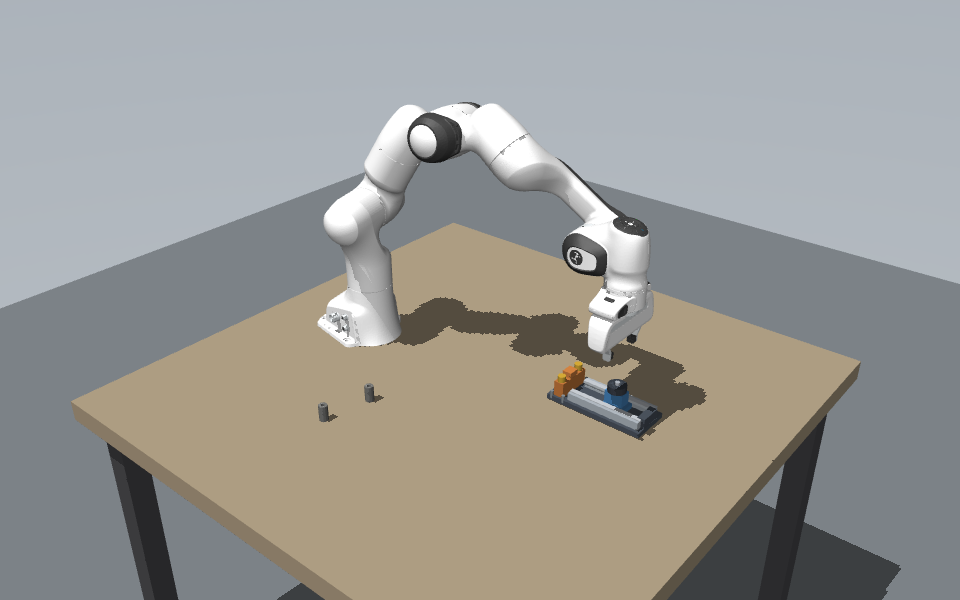
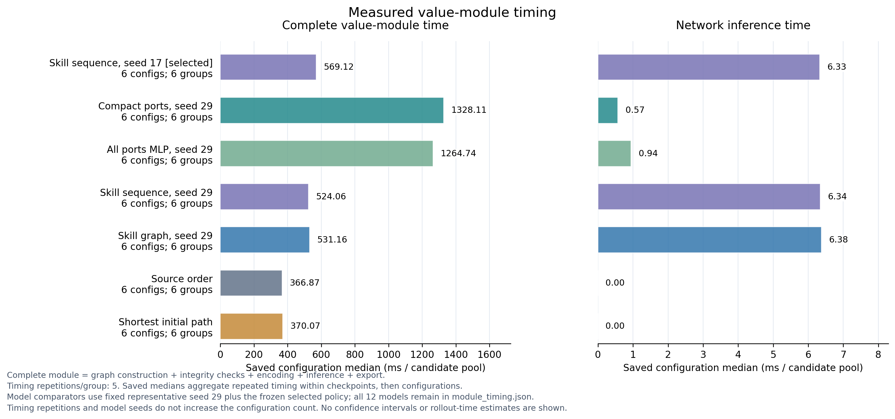
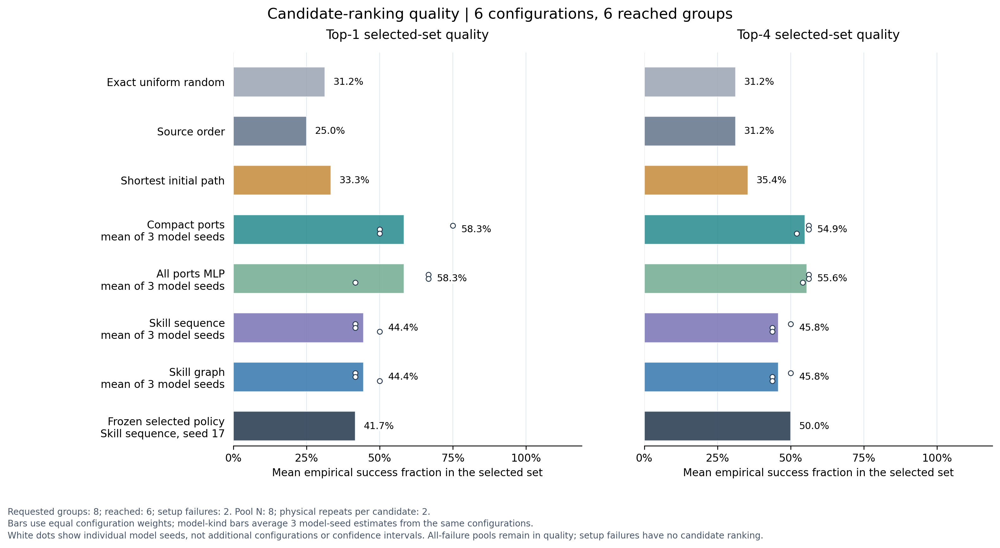

# 价值模块 v4：滑台装配实验结果

日期：2026-09-16。代码分支：`research/skill-graph-value`。本轮在 RTX 2080 Ti 服务器完成新的数据采集、12 个模型训练、冻结测试和独立仿真执行。旧 v3 数据没有混入本轮训练或测试。

**已完成的改进是：让价值模型读取与执行器共享的完整候选程序和类型化技能端口，用实际闭环执行成功直接监督，不再要求额外填写人工风险特征或加权打分标签。** 本轮还实现了已规划关节路径的评分—执行绑定、训练输入自动压缩、同输入图/序列对照、概率校准及完整证据发布。

实验显示输入接口可以统一，紧凑端口 MLP 有初步筛选效果；**尚未证明图关系网络优于同输入序列，也未证明完整闭环优于简单候选顺序基线**。这应作为可复现研究原型和下一轮实验依据，不能写成已证明满足 RAL 投稿要求。

## 1. 如何满足输入与监督要求

外部调用只需要 `observation + candidates`；每个候选是包含任务目标和完整技能调用的 PlanIR。共享注册表生成可执行图，价值模块输出整计划分数和 Top-K 原图，物理验证器消费其中同一份 PlanIR。

```python
from simbench.value.skill_graph import compile_graph
from simbench.value.schema_rank import SchemaScorer

graphs = [compile_graph(inputs["observation"], p)
          for p in inputs["candidates"]]
scorer = SchemaScorer("models/value/v4/best_graph_input.pt", device="cpu")
top_k = scorer.rank(graphs, k=4)
# top_k["top_k"] 中保留 candidate_id、score、完整 graph 和 plan。
```

图中包含机器人状态、对象位姿和名义质量/惯量/摩擦、目标验收条件、调用参数的类型/单位/坐标系、调用顺序及状态依赖。已生成的初始自由运动路径保留每个关节航点，并在执行时逐点重用；依赖未来抓持反馈的路径明确保留为 `deferred`。当前没有相机图像编码，也没有声称执行前已知全部闭环接触轨迹。

训练标签为“整段程序正常完成，且独立任务验收通过”的二元结果。直接用重复执行的结果训练 BCE，未构造距离、力、耗时等人工加权目标。目标容差、控制阈值、候选范围仍是任务和控制器的工程定义；换任务可以重新采集执行结果、训练模型，不需要重新设计加权评分公式。

完整图输入并不意味着编码无损或最优：端口集合汇总会损失精确顺序，数值编码与哈希词表仍是建模选择。有关输入来源、路径绑定、独立验收和论文论证的细节见[方法说明](docs/value-v4-method.md)。

## 2. 数据来自实际机器人仿真装配过程

使用仓库原始滑台场景。机器人逐步装好滑块与端挡，形成检查点 2；或继续按现有生产配方装好左销，形成检查点 3。没有把已装配零件传送到成功状态。剩余候选分别完成“双销与手柄”或“右销与手柄”，含 58 / 40 次实际调用，两种长度都在训练和测试中出现。

每个配置生成 8 个候选，改变合法销安装顺序、各零件抓取姿态、运动路线、夹持力和下降速度；先做必要求解及可执行内容去重，再按固定、与标签无关的顺序取样。供料位置变化为 ±12 mm，执行扰动包含摩擦和驱动增益。同一重复在候选之间配对。没有插入已知成功候选，也没有以编号或无效小扰动凑计划。当前仍是受约束模板候选，尚未评估 LLM 自然语言生成分布。

| 划分 | 预先指定配置 | 到达评分检查点 | 前置失败 | 完整后续执行 |
|---|---:|---:|---:|---:|
| 训练 | 12 | 10 | 2 | 160 |
| 验证 | 4 | 4 | 0 | 64 |
| 测试 | 8 | 6 | 2 | 96 |
| 合计 | 24 | 20 | 4 | 320 |

每候选有 2 次配对重复；320 次执行只对应 20 个到达评分点的独立配置，不能当成 320 个独立场景。训练前置失败为 51107、51109；测试前置失败为 51301、51303，全部留存且未补采替换。测试 51304 到达评分点，但 8 个候选全部失败。开发试验单独打包，不参与上表或正式模型训练。

这里“到达评分点”要求物理检查点和候选输入都已形成。51109 的失败是未能物化初始路径候选；其余三个前置失败记录为 IK 不可达。因此前置失败不能一概解释成零件装配失败。

事后数据审计显示，这批候选仍有明显偏差：任一待装销的抓取 yaw 为 0 时观察成功 **0/184**，所有待装销 yaw 为 π/2 时 **94/136**；三个力档、三个初始路线均有成功，因此不是单一夹持力或路线决定标签。226 次失败中，166 次首先记录在 `open_gripper`（释放左销 49、右销 117），约占 73.5%。这些是相关性描述，不是因果实验，但提示模型可能依赖容易区分的抓取特征，而非理解复杂装配依赖。生成规则确实影响真实执行，仍不能说候选分布已充分模拟实际装配工作。详细计数见[候选与失败审计](docs/evidence/value_v4/candidate_audit.json)。

审计确认 160 条计划组内无可执行内容重复，每池有 6–8 条不同初始轨迹、4–7 个初始抓法；所有初始轨迹均为 **3 个离散关节航点**，不能写成复杂全程轨迹数据。零件之间独立变化的是抓取 yaw 和高度，夹持力、下降速度和净空在同一计划的各零件间共享。12 个 cp2 候选池中 10 个包含两种合法销安装顺序；cp3 顺序固定。正式采集共成功 94 次，训练/验证/测试分别为 50/14/30 次。

协议先于测试结果确定，见[预注册协议](docs/value-v4-protocol.md)。模型按验证 Hit@4、Top4 质量、Hit@1、Brier 顺序选出 `sequence_17`；[冻结清单](docs/evidence/value_v4/frozen.json)在提交 `e94448d` 中先行发布，之后才打开测试结果。这里保留该模型作为主结果，没有用测试表现更好的种子替换它。

## 3. 离线筛选结果与统计边界

候选经验质量是 2 次物理执行的成功比例。Hit@K 表示 Top-K 含经验最优差距不超过 0.1 的候选；全失败池不计入 Hit 分母，所以以下 Hit 分母为 **5**。Top-K 质量是所选候选经验成功率的平均值，包含全失败池，配置分母为 **6**。它不是选定计划的独立执行成功率。

| 方法 | Hit@1 | Hit@4 | Top1 平均质量 | Top4 平均质量 | 校准后 Brier |
|---|---:|---:|---:|---:|---:|
| 均匀随机（解析期望） | 32.50% | 80.86% | 0.3125 | 0.3125 | — |
| 原始候选顺序 | 20.00% | 60.00% | 0.2500 | 0.3125 | — |
| 初始关节路径最短 | 40.00% | 60.00% | 0.3333 | 0.3542 | — |
| 冻结模型 sequence_17 | 40.00% | 100.00% | 0.4167 | 0.5000 | 0.1897 |
| 紧凑端口 MLP，3 种子均值 | 53.33% | 100.00% | 0.5833 | 0.5486 | 0.1270 |
| 未裁剪端口 MLP，3 种子均值 | 53.33% | 100.00% | 0.5833 | 0.5556 | 0.1329 |
| 序列模型，3 种子均值 | 40.00% | 100.00% | 0.4444 | 0.4583 | 0.1898 |
| 图关系模型，3 种子均值 | 40.00% | 100.00% | 0.4444 | 0.4583 | 0.1898 |

所有模型种子为 17 / 29 / 43，使用相同新数据、60 轮上限、最低验证 Brier 轮次。三种子均值不是增加了三倍独立测试配置。逐模型、逐检查点、原始与校准结果全部保留于 [CSV](docs/evidence/value_v4/ranking_summary.csv) 和 [JSON](docs/evidence/value_v4/ranking_audit.json)。

随机期望由 `1 − C(N−M,K)/C(N,K)` 计算，不依赖抽取一个有利的随机种子。在当前五个固定候选池中，每池独立随机选 4 个也有约 30.0% 的概率全部命中。因此 5/5 不能直接解释成很强的学习证据；5 个独立二项观察的 Wilson 95% 区间约为 56.6%–100%，且这个区间也没有消除每候选仅 R=2 的质量估计噪声。现有配置 bootstrap 在全命中时会退化为 [1,1]，不能当作保证。

若把两个前置失败也纳入，冻结模型 Top-4 至少包含一个观察成功候选的比例是 **5/8=62.5%**；Top-1 为 **3/8=37.5%**。这仍是参考执行集上的可行覆盖，下面另报实际在线验证后独立执行。

自动紧凑化仅根据训练输入删除常量和逐位重复列：56,275 → 641 维，MLP 参数量 3,603,777 → 43,201，减少约 83.4 倍。三种子的平均 Top4 质量与未裁剪 MLP 接近，但训练中等价的列在新任务中可能分化，因此不能说找到了最优或最小充分输入。

冻结模型在检查点 2 的 Hit@1 为 0/3、Top1 质量为 0.125；检查点 3 分别为 2/2、1.000。两个子集均很小，且模型主要分数差异来自检查点类别，不能把整体结果解释为已经掌握多部件计划内的细粒度区别。

### 校准与数值诊断

冻结模型在测试上的 Brier 从原始 **0.1759** 变为校准后 **0.1897**，log loss 从 **0.5824** 变为 **0.6277**，说明验证集上的校准收益没有迁移。Brier 此处是到候选经验成功率的误差；逐次 Bernoulli Brier 在证据中另列，不能混用绝对值。

序列/图模型在同一候选池的输出很接近。验证输入上的 CPU/GPU 与候选逆序诊断显示，冻结模型 Top1 和 Top4 集合均一致，但 Top4 内部顺序并非全部一致；种子 43 的图/序列模型有一个验证配置 Top1 随设备变化。诊断没有读取测试标签，也没有修改模型。不能凭近乎常数的分数宣称已学到稳健的细粒度物理风险，更不能据此解释注意力为因果关系。

## 4. 实际在线验证、独立执行与耗时

按预注册的四个配置 51300–51303 重新建立物理检查点，评分后实际验证候选。Top-4 方法每候选做 2 次 `online` 扰动执行；接受观察成功率至少 0.5 的候选，按成功率及原排序选择，再做 2 次独立 `deployment` 扰动执行。没有查参考结果表。穷举方法验证全部 8 个候选，预算明确加倍。

| 方法 | 每到达配置的在线执行数 | 全部在线执行数 | 独立执行成功 / 预定请求 | 已到达配置策略耗时均值 |
|---|---:|---:|---:|---:|
| 冻结 sequence_17，K=4 | 8 | 16 | 3/8 = 37.5% | 291.8 s |
| 原始顺序，K=4 | 8 | 16 | 3/8 = 37.5% | 225.0 s |
| 最短初始路径，K=4 | 8 | 16 | 1/8 = 12.5% | 171.2 s |
| 穷举，N=8 | 16 | 32 | 3/8 = 37.5% | 400.9 s |

每方法请求四配置 × 两次执行，分母均为 8。两个 cp3 配置前置失败，计零成功且未进入在线验证；最短路径在 51300 没有通过在线验证的候选，也计零成功。其余方法实际独立执行 4 次，成功 3 次；最短路径实际执行 2 次，成功 1 次。整个部署对照共 **80 次在线验证 + 14 次独立执行**，不能将不同方法的重复算成额外独立配置。

策略耗时包括评分、实际在线验证与独立执行，不包括共享检查点准备和候选生成；仅对两处到达评分点的配置平均。冻结模型比此次穷举少用一半在线执行，策略耗时平均低约 27.2%，但与同预算原始顺序相比没有成功收益，而且更慢。失败候选较早终止，因而少耗时不能直接解释成更好的策略。两个有效配置不足以建立可靠的端到端优越性。

本轮四配置采用四个独立 CPU 工作进程，实际总墙钟为 1,139.4 s；它与表中逐策略时间是不同统计量。到达配置的共享检查点准备约 16.4–17.6 s、候选生成 2.1–2.4 s、图构造约 0.20 s。失败配置的准备时间仍保留。详见[部署汇总](docs/evidence/value_v4/deployment_summary.json)和原始执行归档。



上图直接渲染该次执行结束后的 MuJoCo 状态，渲染前没有额外步进或调整零件位置；它是场景记录，成功依据仍是已保存的执行和验收结果。对应失败执行、侧车元数据和其他方法终态亦在归档中。

在全部物理任务结束后，使用 GPU 0 单独测量 12 个模型及两个基线，每个已到达测试配置重复 5 次，模型驻留且 CUDA 同步。以下为每配置先取重复中位数、再取配置中位数；单位是 **每个 8 候选池**，不是单条计划。

| 方法示例 | 网络推理 | 包含构图、检查、编码与导出的完整模块 |
|---|---:|---:|
| 冻结 sequence_17 | 6.33 ms | 569.1 ms |
| compact_17 | 0.58 ms | 1,283.7 ms |
| port_mlp_17 | 0.94 ms | 1,311.7 ms |
| graph_17 | 6.35 ms | 521.5 ms |
| 原始顺序 | 无网络 | 366.9 ms |

完整模块的主要成本在 CPU 图检查和编码，不能只用亚毫秒 MLP 推理宣称整个评分接口亚毫秒。紧凑模型减少参数和网络计算，但仍先构造完整端口向量，端到端模块时间没有获得同等幅度改善。各阶段各自取中位数后不必精确相加；完整模块中位数来自每次实测总时间。全部模型、30 个重复测量记录/方法及加载时间保留在[计时证据](docs/evidence/value_v4/module_timing.json)。



## 5. 发布与验证

已发布四份归档：正式数据、独立执行、开发记录和源码/资源快照，位于 [datasets/value](datasets/value/README.md)。全部 12 个模型及其训练历史、输入变换、划分、校准与来源保存在 [models/value/v4](models/value/v4/README.md)，选定权重别名严格对应 `sequence_17`。

[发布清单](docs/evidence/value_v4/manifest.json)记录 115 个产物和每个归档成员的 SHA256，总产物约 101 MB，最大单文件约 17.8 MB。正式采集和训练所用源码均有可匹配哈希的精确副本；4 份历史开发来源清单存在明确记录的源码缺口，不声称这些开发版本可以精确复现。清单本身 SHA256 为 `5f14f26c23f4c24cf498482c8b45d0a8f219d2fd1db6929286bf6c577d6be368`，其代码记录提交为 `2d99510`；后续提交发布数据和报告。

完整回归 **138 项通过，40.11 s**。另行核查了 16 条部署决策与汇总一致、80+14 次原始执行、命名空间扰动隔离、Top-K 及验收选取、模型/图/输入哈希和 7 张实际终态渲染。正式执行与独立部署均无超时。直接记录物理命令的测试验证了初始关节路径没有被执行器重新规划替换，独立目标验收防止截短程序成为正样本。

复现已有模型、重画图表或重新执行时，使用[运行说明](docs/value-v4-running.md)。原始冻结文件含服务器绝对路径；迁移路径时创建新的冻结记录并核对同一权重和选择，不覆盖原证据。所有参考标签、失败和开发结果均保留，可据此核查结论。



## 6. 对 RAL 路线的判断

目前最清楚、已有实现依据的研究主线是：**由可执行技能契约编译计划级价值输入，显式表达已知运动参数和反馈待求解参数，直接学习接触装配结果，再用于有限孪生验证预算的候选筛选。** 原子技能图谱的当前优势在于统一数据来源、参数绑定和执行语义；图网络的额外预测优势还没有获得证据。

PIGINet 已包含初始物体位姿和关节角，不能写“它没有物理参数”。可讨论的区别是其待评分任务骨架去除了待求解的连续动作参数，而这里保留实际可执行程序、已物化路径和闭环参数来源；整计划评分和 Transformer 本身不是新颖点。见 [PIGINet 原文](https://roboticsproceedings.org/rss19/p061.pdf)及本仓库[相关工作对照](docs/value-v4-method.md)。

下一轮应在新的锁定测试配置上验证三项主要假设：同输入移除轨迹/控制信息的训练消融；未见依赖组合下的图/序列比较；来自实际 LLM 和实物误差范围的候选，在相同验证预算下能否改善独立执行成功率。需要增加独立配置和重复，覆盖前两部件、全行程功能验收以及真机观察误差。目前没有完成真机实验、视觉输入、完整滑台功能验证或跨任务迁移，也没有证明输入选择最优。
