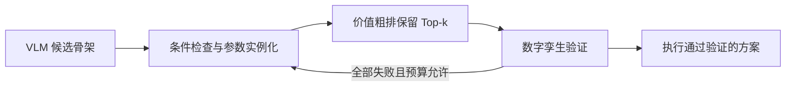

# 技能、规划实例与条件图

状态：2026-09-08 讨论整理。下列任务级划分是下一阶段设计，尚未实现统一接口。

## 技能粒度

原来的 30 项混合了任务动作、规划计算、控制步骤和检查器，作为底层组件保留。任务规划层拟采用：

| 能力 | 成功语义 | 复用组件 |
|---|---|---|
| Observe | 获得目标状态与不确定性 | 检测、位姿估计 |
| Move | 保持抓持关系并改变末端位姿 | 路径规划/执行、上移、下移、回位、转腕、退出 |
| Grasp | 建立可靠抓持关系 | 接近、闭爪、夹持检查；调用抓取候选模块 |
| Place | 将物体稳定支撑并释放 | 对准、接触下降、松爪、撤回及内部检查 |
| Insert | 建立插入配合 | 对准、沿轨插入、寻孔、压靠、学习插入 |
| Actuate | 沿已有物理约束操作 | 当前为滑块推拉；抽屉等需新增适配 |
| Inspect | 判断显式任务条件 | 装配位置、行程、间隙 |
| Recover（异常机制） | 从指定失败状态撤回或有限重试 | 接触撤回、重新感知/规划 |

“原子”相对于任务规划层而言，内部允许状态机、规划与反馈控制。每个技能自行检查成功，VLM 不应拼接所有夹爪细节。恢复不是万能成功保证。

适用目标是桌面刚体操作与简单装配。旋拧紧固、柔性物体等需要确实实现新的接触机制后扩展，不能仅增加名称宣称支持。

## 规划多解

区分技能类型、求解/执行实现、参数实例。抓取位姿生成与路径规划是不同计算模块；同一模块产生多个解，不新增技能。规则与学习插销可作为 Insert 的不同策略，并记录各自适用条件。

同一 `Grasp → Move → Insert` 骨架可以生成不同抓取、路径、控制参数与终态的具体候选。价值模块对候选排序。逐步扩展候选、共享缓存，避免无约束的笛卡尔积。

## 条件图

类型图表示“在某些条件下可能衔接”，场景实例图才绑定对象、参数与状态。实例边要求前一步的终态满足下一步的启动条件。

沿整条计划传播抓持对象、手—物变换、机器人状态、物体位姿/支撑关系和规划有效范围。若相邻两条边分别依赖不同抓法，而中间没有换抓，就不能断言整链可行。

验证分三层：

1. 结构与资源：类型、前置条件、效果、夹爪占用、数据依赖和最终目标。
2. 便宜几何检查：尺寸/开度、关键姿态 IK、粗略碰撞、轴向和参数一致性。
3. 数字孪生：闭环执行、接触、滑移、卡滞及终态检查。

结果区分“已发现冲突”“已通过所做的必要检查”“尚未确定”。有限采样未找到 IK/路径不自动证明不可行。未知约束继续交给后续验证。

图谱质量用跨任务复用、冲突检出、误拒绝及节省的仿真调用评估，不以节点数衡量。

## 当前实现边界

`assembly/graph.py` 检查组件参数、对象绑定、夹爪状态与数据依赖。展示连线包含手写关系；验证器尚未完成整链几何传播，仍绑定滑台零件名单。方块演示直接复用 Session，不代表通用图谱已支持方块。

下一阶段需让技能契约、状态效果、图谱生成和验证器共用同一模型，将对象清单外部化。当前控制、场景、演示和测试保留为实现底座。

## 研究定位

不使用“传统 TAMP 完全忽略终态及后续影响”的表述。[LGP](https://www.ijcai.org/Proceedings/15/Papers/274.pdf) 已优化终态几何与长程影响，[PDDLStream](https://ojs.aaai.org/index.php/ICAPS/article/view/6739) 已结合符号规划和连续参数生成。

本项目拟研究面向后续任务的终态价值学习，以及有限数字孪生预算下的高召回候选筛选。已知任务后缀与未知后续任务分布分别定义、训练和评估。
