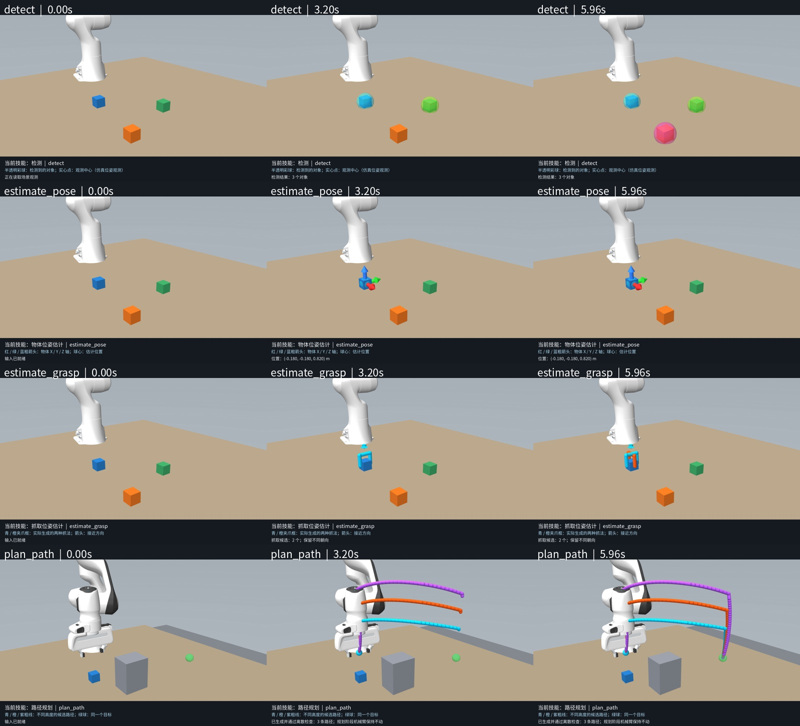
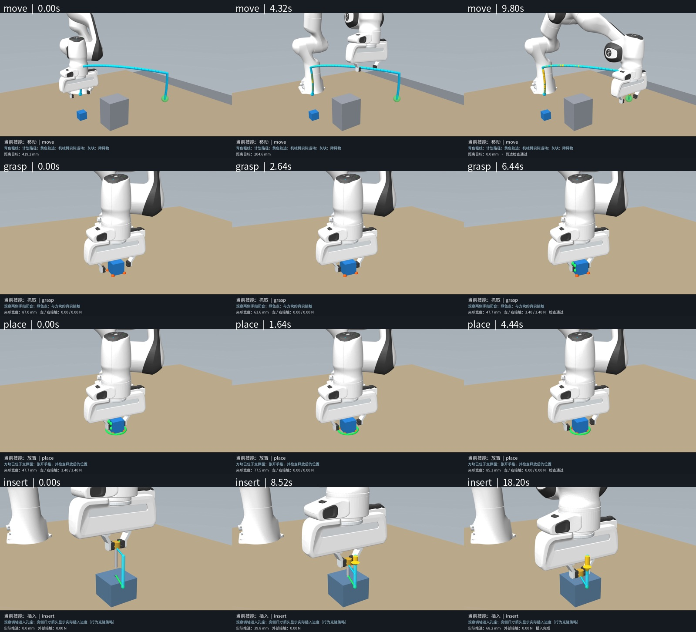
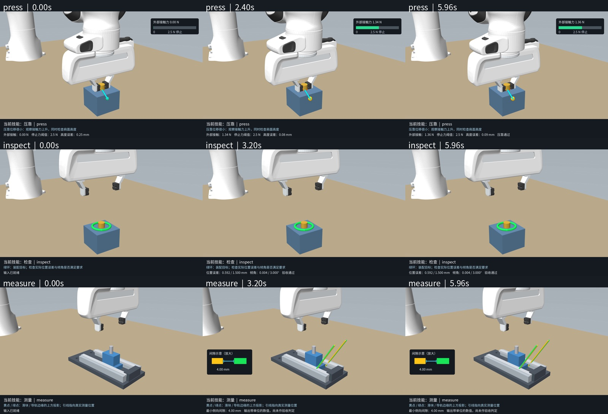

# 原子技能近景录制验证

日期：2026-09-08。源码基于 `200ab4b`，本轮仅增加录制入口、相机配置、显示标记及文档；原控制器、技能契约与物理场景资源未更改。

- 11 个默认原子技能均真实调用成功，每项一段新视频。
- 1600 × 1000，25 fps，固定正面偏侧近景；路径等线条半径乘 2.8。小插销接触球缩小，避免遮挡。
- 已解码核对每段的分辨率、帧数、帧率、时长、SHA-256。
- 已检查全部 33 张首帧、执行中帧、末帧；见下方三张抽帧表。插入全程夹爪、销轴和孔座保持可见。
- 计算技能前后完整 MjData 数组相等、仿真时间不变；装饰绘制前后再次检查数组相等。装饰仅加入 MjvScene。
- 检查技能的场景首末帧可以相同，其输出变化体现在底部验收数值；不人为移动机器人伪装动作。
- 原有回归测试 44/44 通过，见 `tests.txt`。

本轮只是演示与显示验证，不是鲁棒性试验或新的策略成功率。检测是仿真位姿观测，插销仍是行为克隆。压靠停止力阈值为 2.5 N，成功检查还包括实际接触和高度误差；最终力不必恰好等于该停止阈值。

`verification.json` 包含逐技能执行结果、计算阶段标记、可见像素、抽帧索引与视频哈希。主视频清单位于 [视频索引](../../demos/INDEX.md)。

