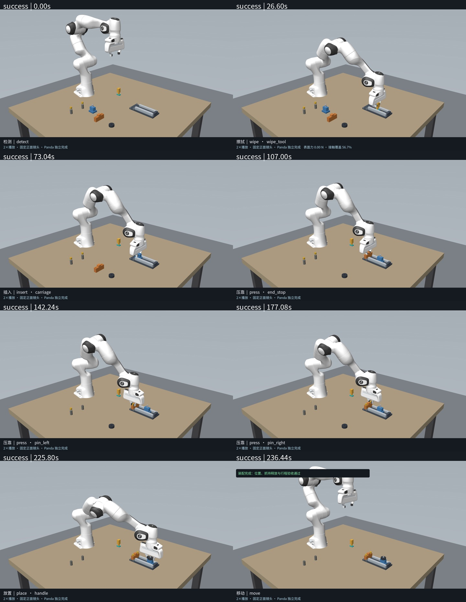
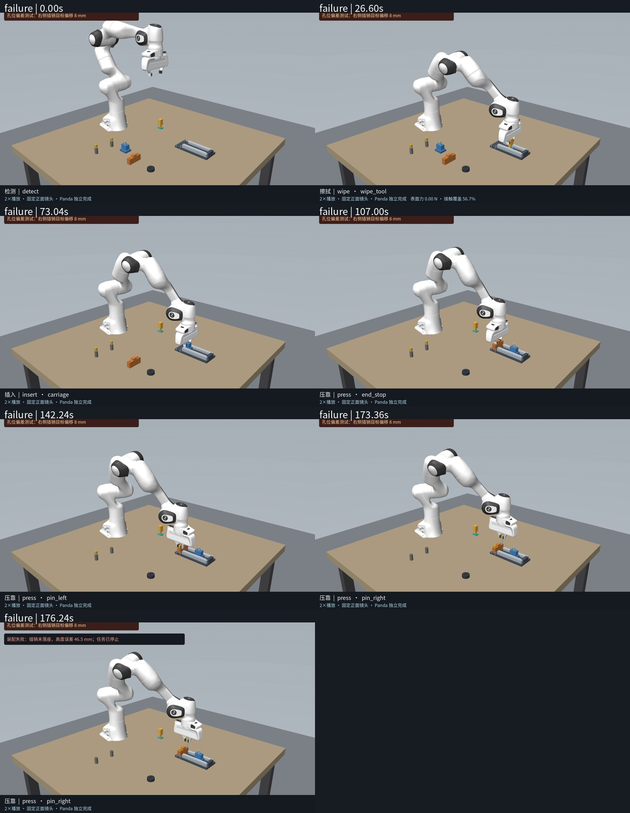
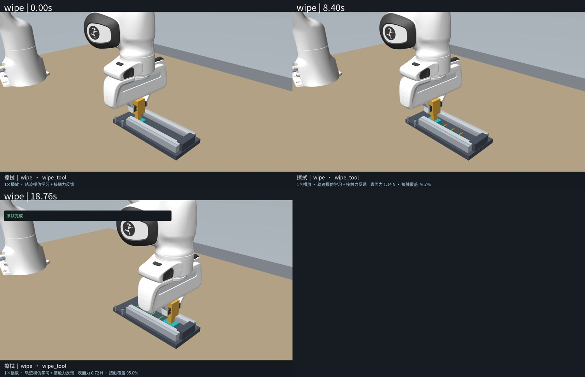

# 擦拭与完整装配验证

日期：2026-09-08；基于 `1fad0ac`。原 IK、路径跟踪和装配控制器保留；新增表面轨迹模仿技能、被动擦拭工具、条件图及完整演示入口。

- 默认目录 10 个原子技能，条件依赖图 14 条边。测量和检查为辅助工具。
- 回归测试 47/47 通过。进一步验证擦拭路径的抓持时刻绑定，不允许重新抓取后复用旧绑定。
- 默认十项独立演示无录像执行检查全部通过，见 `atomic-ten-checks.json`。
- 完整成功：138 条底层/辅助调用，所有调用成功，覆盖全部 10 项原子技能；312.66 秒物理仿真。视频 5912 帧、236.48 秒。
- 完整失败：98 条调用，前 97 条通过；右侧插销目标沿 X 偏移 8 mm 后，压靠检查测到约 46.54 mm 高度残差而失败。视频 4407 帧、176.28 秒。保持原验收阈值，停止后续任务，不把失败改判成功。
- 擦拭单项：24 条程序化专家示例拟合的 RBF 轨迹策略；实际覆盖率 95%，接触步占比约 85.86%，峰值力约 3.28 N。独立视频 470 帧、18.80 秒。
- 三段视频均 1920 × 1200、25 fps。完整视频明确标注 2× 播放；单项擦拭为 1×。已解码检查帧数、分辨率、帧率，记录 SHA-256，并检查首帧、关键动作中帧与末帧。
- 场景始终仅 9 个 Panda 执行器；新工具为自由被动刚体，装配零件不增加驱动。

这是两个明确配置的示范案例，不是统计鲁棒性评测。旧插销模仿策略对新增擦拭前序后的状态变化出现敏感性；本次完整展示使用已有接触反馈分支，未宣称旧学习策略已变得鲁棒。擦拭学习只拟合参考轨迹，仍由接触反馈和原控制器执行；不模拟抛光材料去除。

逐次结果见 `summary.json`、`*_verification.json`、`*_steps.json`、`*_timeline.json`；视频哈希位于 verification 中。图谱来源见 [共享契约图](../../skill-graph/README.md)。

