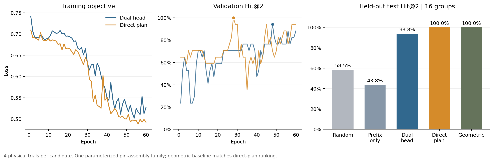
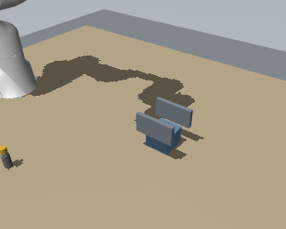

# 价值粗筛 v1：实现、训练与验证记录

日期：2026-09-15。已完成真实 MuJoCo 数据采集、RTX 3090 训练、Top-K 导出和新配置的仿真执行。代码入口与设计见 [运行指南](../../value-screening.md)。

## 交付结果

- **推荐模型**：[整计划单头](../../../models/value/plan_value_direct_v1.pt)。根据验证集选择：Hit@2 为 17/17、Regret@2 为 0。
- **双头研究模型**：[前缀概率 × 条件后续概率](../../../models/value/plan_value_v1.pt)。验证集 Hit@2 为 16/17。
- **数据**：[100 组、800 个候选、3,200 次物理试验](../../../datasets/value/pin_suffix_v1.tar.gz)，以及 [数据清单](../../../datasets/value/manifest.json)。
- **新配置 Top-2**：[完整可执行 PlanIR 输出](direct_new_case_top_k.json)；[孪生验证和执行结果](direct_new_case_decision.json)。
- **回归验证**：[59 项测试通过](tests.txt)，包括前后缀隔离、掩码、条件标签、配对扰动、执行参数绑定和精确快照恢复。

两个模型均使用 128 维、3 层、4 头 Transformer；评分网络 1,730,947 个参数，视觉特征来自冻结 ImageNet ResNet-18。均训练 60 轮，按验证集选择的 checkpoint 分别为单头第 28 轮、双头第 48 轮。训练循环记录耗时约 56.8 秒和 85.1 秒，不包含数据采集和视觉特征缓存。

## 保留测试集结果

预先固定 67/17/16 个配置作为训练/验证/测试；同组候选与重复试验不拆分。测试集包含 16 个有可行且有不可行候选的问题组。K=2，近优容差 epsilon=0.1，参考值来自每个候选 4 次试验。

| 方法 | 近优 Hit@2 | Regret@2 | Top-2 包含可行候选 |
|---|---:|---:|---:|
| 随机筛选的精确期望 | 58.48% | 0.3711 | 64.73% |
| 双头模型的前缀头消融 | 43.75% | 0.4688 | 56.25% |
| 双头后续价值 | 93.75%（15/16） | 0.0625 | 93.75% |
| **推荐单头整计划价值** | **100%（16/16）** | **0.0000** | **100%** |
| 现有几何代价基线 | 100%（16/16） | 0.0000 | 100% |
| 全候选验证参考 | 100%（16/16） | 0.0000 | 100% |

**这批结果没有证明学习方法优于现有几何规则，也没有证明双头优于单头。** 单头被推荐是因为其验证集筛选表现更好；测试集没有参与训练或 checkpoint 选择。单头检查点的前缀头未单独训练，其附带 `prefix_head` 评估项不应作为有效对照，表中只使用双头模型的前缀头。



完整指标与逐候选预测：[单头](direct_test_metrics.json)、[双头](dual_test_metrics.json)。经验率 Brier 误差分别为 0.1902 与 0.1472；推荐模型的排序较好不意味着其概率已经校准，**不要把输出分数当成可靠成功率阈值**。

从每组 8 个候选保留 2 个，验证候选数上限减少 75%；这不是端到端加速比。当前几何基线无需学习就达到同等筛选结果，不能据此声称神经网络带来了不可替代的收益。

## 新配置实际执行

额外固定种子 9000，不属于训练/验证/测试配置。推荐模型输出 Top-2 后，第一次孪生试验通过；恢复相同初态后再次实际运行该方案，完整后缀通过。总流程约 8.87 秒，验证调用 1 次（预算 2 次）。双头模型也在同一预定配置上通过，约 9.07 秒。

该结果是一个新配置的闭环接口验收，不能当作闭环成功率统计。动作全部由 Panda 执行器驱动，验收包括压靠、支撑释放、退出和最终位置/倾角；没有传送零件或自动焊接到位。



## 数据与局限

1. **范围只有滑台销装配子任务家族**，变化供料/接收位置、孔间隙、通道方向/宽度/高度和退出距离。尚无连接器、轴系跨家族验证，当前采集计划固定为 13 个调用；变长能力只经过实现测试，未做长任务泛化实验。
2. **3,200 次前缀均成功，1,330 次完整后缀成功**。这批数据适合检验释放/后续粗筛，不能验证前缀失败预测能力；这也是首版推荐单头的原因之一。双头的条件标签逻辑已经实现并测试，但需要补充前缀失败场景。
3. 每候选只有 4 次重复，测试仅 16 组。100% 命中不是可靠的最优保留保证，也不能外推到真实机器人。后续应扩大独立配置和参考重复次数。
4. 感知使用仿真位姿与实例裁剪；未验证真实检测、视角变化、长后缀组合或底层控制器变化。
5. 应继续增加有实际工艺意义的场景和剩余目标，检验几何规则不足时的收益；不能通过伪造难例、复制标签或降低基线输入质量制造优势。

## 复现

安装环境后，在仓库根目录执行：

```bash
# 解压后得到 results/value/data，含初态图片、视觉缓存、输入和真实标签。
tar -xzf datasets/value/pin_suffix_v1.tar.gz

# 直接使用推荐权重输出 Top-2，不读取 outcomes.json。
python -m simbench.value.rank \
  --checkpoint models/value/plan_value_direct_v1.pt \
  --input results/value/data/group_001000/inputs.json \
  --k 2 --device cuda --out results/value/top_k.json

python -m simbench.value.evaluate \
  --checkpoint models/value/plan_value_direct_v1.pt \
  --data results/value/data --split test --k 2 --device cuda

export MUJOCO_GL=egl OMP_NUM_THREADS=1 OPENBLAS_NUM_THREADS=1
python -m simbench.value.decision \
  --checkpoint models/value/plan_value_direct_v1.pt \
  --seed 9000 --k 2 --budget 2 --device cuda --execute
```

新训练可用 `scripts/train_plan_value.sh`，或按 [运行指南](../../value-screening.md) 的命令单独运行。准确的采集版本另存于 [源码快照](../../../datasets/value/pin_suffix_v1_source.tar.gz)，如需逐版本复现，应解压到独立目录；不要覆盖当前工作目录。源码与数据 SHA-256 见清单，交付文件校验见 [artifact_checksums.json](artifact_checksums.json)。

服务器现成工作目录：`/root/rivermind-data/twingraph`；解释器：`/root/rivermind-data/twingraph-venv/bin/python`。使用该环境运行仓库里的 `results/value/direct/best.pt` 或 `results/value/dual/best.pt` 即可，无需重新安装 CUDA。

运行时版本见 [environment.json](environment.json)。两次训练使用同一数据指纹 `6fa66976839d1627d0fcdab44299d03bb44fe4642f9750194e59bf07b6570a72`；划分清单和训练设置均随模型记录。
