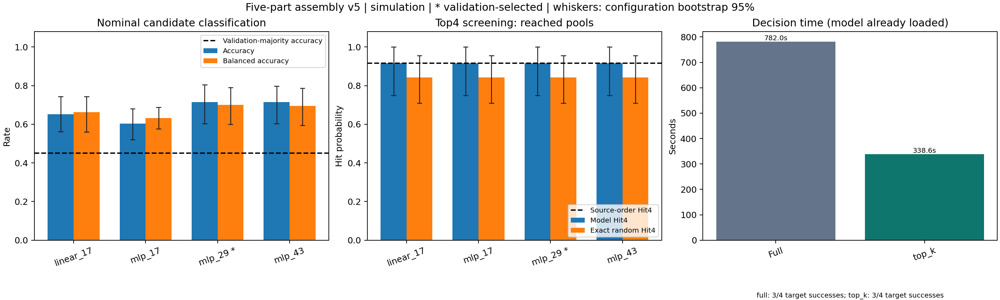

# 滑台装配价值模块 v5 实验报告

证据状态：supplied_evidence_complete；验证集选定模型：mlp_29。

## 候选预测与筛选

分类指标以成功生成候选的名义物理执行为分母；Hit4 表示至少保留一条成功候选。分类阈值固定自验证集，随机对照为无放回子集的精确期望。

| 模型 | 验证Brier | 阈值 | 测试准确率 | 平衡准确率 | Top4成功占比 | 随机成功占比 | Hit4（达到候选池） | 随机Hit4 | Hit4（全部请求） |
|---|---:|---:|---:|---:|---:|---:|---:|---:|---:|
| linear_17 | 0.215 | 0.458 | 65.3% | 66.3% | 62.5% | 45.1% | 91.7% | 84.2% | 91.7% |
| mlp_17 | 0.210 | 0.312 | 60.4% | 63.2% | 66.7% | 45.1% | 91.7% | 84.2% | 91.7% |
| mlp_29（选定） | 0.205 | 0.570 | 71.5% | 70.1% | 66.7% | 45.1% | 91.7% | 84.2% | 91.7% |
| mlp_43 | 0.206 | 0.667 | 71.5% | 69.6% | 62.5% | 45.1% | 91.7% | 84.2% | 91.7% |

外部接口为结构化观测与完整类型化技能程序；字段按接口自动展开，仅用训练输入删除常量及重复列。下表为实际数据产生的维度，不是手工选择的87个特征；表示是否最优尚未验证。

| 模型 | 参数量 | 自动展开原始维度 | 保留输入维度 | 元数据状态 |
|---|---:|---:|---:|---|
| linear_17 | 81 | 7705 | 80 | verified_summary_detail |
| mlp_17 | 7297 | 7705 | 80 | verified_summary_detail |
| mlp_29 | 7297 | 7705 | 80 | verified_summary_detail |
| mlp_43 | 7297 | 7705 | 80 | verified_summary_detail |

价值调用延迟按模型已加载后的整池调用统计，正式协议每池 N=12；实际候选数及观测次数列于下表。下列数值单位均为毫秒，阶段括号内为该阶段的实际观测次数。内部 total 与各阶段重叠，不可相加；整体加速仍以独立运行的成对系统计时为准。

| 模型/划分 | 实测N | 整池调用次数/可用池 | 整池均值 | 整池P95 | 建图均值(n) | 编码均值(n) | 推理均值(n) | 导出均值(n) | 内部total均值(n) |
|---|---|---:|---:|---:|---:|---:|---:|---:|---:|
| linear_17/validation | [12] | 12/12 | 809.256 | 820.280 | 407.259 (12) | 312.603 (12) | 0.318 (12) | 58.792 (12) | 778.979 (12) |
| linear_17/test | [12] | 12/12 | 807.539 | 826.835 | 409.779 (12) | 309.125 (12) | 0.322 (12) | 57.858 (12) | 777.092 (12) |
| mlp_17/validation | [12] | 12/12 | 807.041 | 841.223 | 408.688 (12) | 308.873 (12) | 0.443 (12) | 58.591 (12) | 776.601 (12) |
| mlp_17/test | [12] | 12/12 | 816.927 | 843.239 | 416.644 (12) | 309.203 (12) | 0.460 (12) | 58.937 (12) | 785.251 (12) |
| mlp_29/validation | [12] | 12/12 | 800.344 | 825.618 | 361.783 (12) | 328.737 (12) | 0.431 (12) | 78.800 (12) | 769.756 (12) |
| mlp_29/test | [12] | 12/12 | 805.006 | 828.522 | 367.145 (12) | 326.628 (12) | 0.444 (12) | 79.729 (12) | 773.954 (12) |
| mlp_43/validation | [12] | 12/12 | 771.363 | 820.189 | 333.813 (12) | 327.115 (12) | 0.426 (12) | 79.299 (12) | 740.659 (12) |
| mlp_43/test | [12] | 12/12 | 784.654 | 835.357 | 340.709 (12) | 331.724 (12) | 0.462 (12) | 80.686 (12) | 753.587 (12) |

验证集多数类固定预测为 1（验证正例 75/144）；测试准确率 45.1%，平衡准确率 50.0%。
原始候选顺序 Top4 的成功候选占比为 45.8%，Hit4 为 91.7%；计入候选生成失败后的请求分母结果为 91.7%。候选池达到 12/12，失败 0。

## 原始数据与候选多样性

| 划分 | 已记录请求/预定 | 完成 | 输入前失败 | 未完成 | 候选 | 名义成功/执行 | 超时 | 完全重复程序 | 全失败池 | 全成功池 |
|---|---:|---:|---:|---:|---:|---:|---:|---:|---:|---:|
| test | 12/12 | 12 | 0 | 0 | 144 | 65/144 | 0 | 0 | 0 | 0 |
| train | 48/48 | 48 | 0 | 0 | 576 | 287/576 | 0 | 0 | 1 | 0 |
| val | 12/12 | 12 | 0 | 0 | 144 | 75/144 | 0 | 0 | 0 | 0 |

test 每池初始轨迹分支范围 [4, 6]，完整抓取选择分支范围 [11, 12]，程序长度 [101]；首次失败技能计数 {"lift": 54, "goal_or_untraced_failure": 7, "press_seat": 10, "place_object": 3, "inspect_seat": 5}。

train 每池初始轨迹分支范围 [4, 6]，完整抓取选择分支范围 [11, 12]，程序长度 [101]；首次失败技能计数 {"lift": 138, "press_seat": 66, "place_object": 21, "goal_or_untraced_failure": 43, "inspect_seat": 16, "guarded_descent": 1, "plan_transfer": 4}。

val 每池初始轨迹分支范围 [4, 6]，完整抓取选择分支范围 [12, 12]，程序长度 [101]；首次失败技能计数 {"place_object": 6, "goal_or_untraced_failure": 11, "press_seat": 13, "lift": 37, "plan_transfer": 1, "inspect_seat": 1}。

多样性按同一初态下的实际调用、物理参数和完整初始轨迹检查，剔除候选ID与来源标签；轨迹、顺序、抓取分支及首次失败技能逐池记录于 summary.json。中途失败和开发试验不删除，也不混作测试数据。

## 离线采集与训练成本

离线采集 train, val：批次实际墙钟 2518.391 秒，协议绑定的 16 个进程；请求 60 个配置、720 次物理试验，已完成配置记录 720 次，失败请求 0。实际候选池大小 [12]。

模型训练批次：实际墙钟 172.140 秒，完成 4/4 个模型；设备 ['cuda:0', 'cuda:1']，2 条并发模型通道（每通道内部顺序训练）。

| 模型 | 设备 | 保留输入维度 | 参数量 | 单模型训练墙钟 (s) |
|---|---|---:|---:|---:|
| linear_17 | cuda:1 | 80 | 81 | 81.365 |
| mlp_17 | cuda:0 | 80 | 7297 | 82.483 |
| mlp_29 | cuda:1 | 80 | 7297 | 82.323 |
| mlp_43 | cuda:0 | 80 | 7297 | 80.699 |

以上离线成本与在线常驻模型决策时间分开报告；采集进程数、GPU通道数不同，不能直接相除计算部署次数的盈亏平衡点。批次/派发/协议及模型SHA256绑定见 summary.json；未记录的CPU/GPU产品型号不作推断。

## 独立目标执行与实际时间

full：目标成功 3/4，实际目标调用 4，孪生验证调用 96；已记录 4 个配置。
top_k：目标成功 3/4，实际目标调用 4，孪生验证调用 32；已记录 4 个配置。

top_k 成对决策时间：全量 782.016 秒，筛选 338.569 秒；实际成对时间比均值 2.339。
场景创建至独立执行和终态渲染（不含离线LLM代理生成与进程启动）：全量 834.937 秒，筛选 387.368 秒。均值仅来自完成相同候选预算的成对配置；详细分母和置信区间见 summary.json。

上述系统时间遵循原始 timing_boundaries；模型加载在调用前已完成，提前准备的LLM代理规划记录及进程启动均不在计时内，也不代表多进程批次的总墙钟时间。少量配置的退化置信区间不构成可靠性保证。

另行记录的模型初始化平均耗时为 0.011 秒。
计入该实测初始化后，top_k 冷启动决策时间均值 338.580 秒，全量对照 782.016 秒；Python/Torch 导入仍单独记录，不混入该值。

批次记录的实际并行墙钟时间为 1352.248 秒，状态 completed。
top_k 按预定全部请求计为 3/4；缺失策略结果 0。缺失/程序错误属于未解决请求，不冒充物理负例标签。
full 按预定全部请求计为 3/4；缺失策略结果 0。缺失/程序错误属于未解决请求，不冒充物理负例标签。

## 输入范围与结论边界

linear_17 测试输入：诊断 144/144 条；未见字段影响 0 条，训练常量变化影响 0 条，重复字段关系变化影响 0 条。
mlp_17 测试输入：诊断 144/144 条；未见字段影响 0 条，训练常量变化影响 0 条，重复字段关系变化影响 0 条。
mlp_29 测试输入：诊断 144/144 条；未见字段影响 0 条，训练常量变化影响 0 条，重复字段关系变化影响 0 条。
mlp_43 测试输入：诊断 144/144 条；未见字段影响 0 条，训练常量变化影响 0 条，重复字段关系变化影响 0 条。

- LLM代理保存的 proposed_orders 被实际消费；固定的 stage_calls 任务宏展开为本场景101条技能/检查调用，proposed_skill_programs仅保留为来源说明。抓取和运动求解器实例化物理参数与轨迹。
- 机器人型号及大部分初始观测字段固定或近似静态；仅训练输入上的常量/重复列删除不能证明对广泛机器人状态变化的泛化。
- 输入为仿真器结构化位姿和几何，没有图像输入，也没有图像或视觉感知消融实验。
- 每候选R1名义执行的0/1标签训练的是该分布下的成功估计，不是实测重复扰动成功概率；分类结论不等同于鲁棒性保证。
- 首段自由运动已物化完整关节路径；后续依赖实测抓取的路径保留为延迟求解参数，不能宣称预先提供了全部未来真实轨迹。
- 目标执行使用独立MuJoCo模型/数据和未装配初态；仍为仿真，未完成真机验证。
- 终验覆盖五部件位姿、释放和末端退出，不包含滑动行程或长期装配质量验证。
- 未证明所用表示最优、图结构优于其他表示，也未据此判定满足RAL录用要求。

