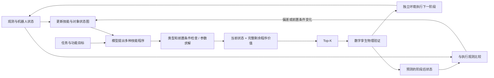

# 从演示到可检验的 RAL 系统

这项工作的核心应是：**用当前状态条件化的完整计划价值，在有限孪生预算内
保留可执行的功能装配方案，并在执行偏离预测时更新剩余计划。**
不是插销的毫米级控制精度，也不能把减少验证次数本身当作学习方法的贡献。

## 各模块承担什么

语言模型负责技能序列、对象绑定、抓法/路径/控制策略和恢复分支；
坐标由观测绑定，关节路径由规划器求解，力/速度选择受技能能力范围约束。
固定的相机标定、CAD 关系和控制安全上限是必要模型参数；固定世界坐标和
忽略观测的候选参数才是应消除的问题。

本轮提供 12 个本次 Codex 编写的语义策略提议，原文 JSON 可审阅；
编译器根据观测更新参数并生成可执行程序。没有把脚本抽样称作每场景
在线调用大模型，也没有给模型提供执行标签。

## 图谱应如何体现价值

图谱包含三类信息：技能的类型化输入/输出及前置效果；实例化对象状态
（已完成、持有、待检测、未知）；候选程序中数据流、对象状态和资源依赖。
同一个编译结果用于价值编码和执行，禁止“给网络看的参数”与“实际执行
的参数”分叉。未知几何约束仍交给孪生，不能凭符号图标成可行。

本轮将装配从一个封装节点展开为 103 个调用节点、524 条依赖边。
仍保留清洁和功能测试控制器的抽象边界，不能宣称全系统均已细粒度展开。
图谱也明确每次检测需要的对象，修复“已安装销被遮挡导致后续抓另一个
零件也失败”的错误依赖。完成状态独立于对象当前是否可见。

未来论文中的公平消融应在**相同训练数据、输入信息和近似参数量**下比较：
图关系模型、无边的集合模型、顺序模型；另比较去掉对象状态版本/观测
缺失掩码后的结果。单纯打乱已有模型的输入边只能作敏感性分析；
若网络本来没有读边，不能用这个实验声称关系建模有效。
本轮冻结模型仍是端口数值读出，并未证明 GNN 的额外收益。
它也尚未利用图中保存的机器人关节状态、完整姿态及依赖边；重规划时
以安装后的观测输入原有整任务模型，存在明显分布偏移。后续应使用阶段
检查点的剩余执行标签训练相应模型，不能把本轮接口实现等同于这个问题已解决。

## 功能任务和失败如何定义

插销要求实际进入指定孔并在松爪、撤离、往复行程后仍保持；绕圆柱轴的
角度不作为成功条件。把手必须能够带动滑块完成实际双向行程，不能仅
看“把手到了目标坐标”。当前 V9 仍有滑块/把手的局部位姿阈值，属于
遗留限制；本轮不在测试结果出现后修改这些阈值来提高成功率。

区分并记录：当前技能失败；当前零件装好但下一技能失败；中间全部完成
但最终功能或保持性失败。后一类才支持跨阶段价值的动机。还必须检查
失败前候选是否已经产生实际控制差异：若所有方案都在相同抬升动作失败，
改变后续插入速度无法提高候选池覆盖，训练再大的网络也无法补救。

建议后续设计影响工作空间和顺序的变化：托盘放置区域、通道占用、
挡块安装顺序、把手抓取可达性、工具归还位置和部件状态不确定性。
这些应来自合理装配场景，并先证明至少两种合法策略在不同状态中各有
优势；避免人为写死“策略 A 在场景 A 成功”或仅制造阈值附近差异。

## 价值模块的训练和证据

目标是 V(G_t, P_remaining)=P(完整剩余功能任务通过 | 当前图与候选程序)。
建议同时记录各阶段首次失败和验证耗时，以训练辅助失败位置与成本预测；
局部技能通过不应成为整条计划的正标签。对同一状态的候选做排序监督，
按布局/任务分组划分训练、验证、测试，不按单条候选随机划分。

先检查候选池是否有足够的混合成败状态及可挽救案例，再增加模型复杂度。
当前历史数据中大量场景全成功或全失败，整体准确率即使较高也不能说明
同场景排序有效。应报告可解覆盖、Hit@K、完整部署成功率、首次找到可行
方案的时间、总决策时间和总任务时间；保留无解场景。

必须比较：全量孪生；随机同 K；价值同 K；随机成功早停；固定参考/简单
规则。部署扰动对所有方法配对。若采用自适应 K 或失败后扩容，随机也要
拥有相同扩容预算。严格保证不丢失“本次有限候选池内”的孪生可行方案，
需要无解时回退到未验证候选；这并不保证未建模的真实世界成功。

“准确性不下降”应预先定义非劣性界限，并报告按场景聚类的配对置信区间。
三个场景的相同成功数只能作系统联调证据，不能作为非劣性证明。
下一阶段先用开发数据估计场景间方差和配对分歧，再确定正式样本量。

## 闭环不是每次偏一点就从头来

每个原子技能内部保留接触/跟踪控制；在放置、插入、功能测试等稳定边界
更新图谱。比较任务相关对象、机器人状态和前置条件，并结合测量不确定性。
小偏差继续执行或重新绑定坐标；影响剩余可行性的偏差才重新生成和筛选。
当前阶段失败时，要区分可恢复的抓取/接触失败与必须停止的物理状态。
本轮只在已释放物体的阶段边界实现有预算的剩余任务重规划；持物中失败
会保留原因并停止，尚未实现通用故障恢复策略。

本轮部署是独立、有摩擦和控制增益扰动的 MuJoCo 环境。初始配对场景
共享生成种子，重规划孪生使用精确仿真检查点同步，局部验收也使用仿真
测量。由此可检验系统编排，但还不能证明传感器重建误差下的孪生有效性
或真实机器人装配性能。

## 与已有工作的关系

[PIGINet](https://piginet.github.io/) 已用完整任务计划的可行性预测改善
任务与运动规划搜索效率。因此“学一个排序器减少昂贵验证”本身不能
作为唯一新意。可争取的区别是功能装配的后续状态价值、可执行技能图
与孪生的一致接口，以及执行反馈下的预算分配；这些区别仍需实验支撑。

[SayCan](https://say-can.github.io/) 将语言相关性与当前状态下的技能
可供性结合。本项目需要额外证明完整剩余程序比仅预测下一技能更有效。
[Inner Monologue](https://innermonologue.github.io/) 已研究利用执行反馈
更新语言规划。本项目的闭环贡献应落在可测量的孪生预测残差、状态更新
和重规划成本/收益上，而不是仅增加一个“重规划”箭头。
