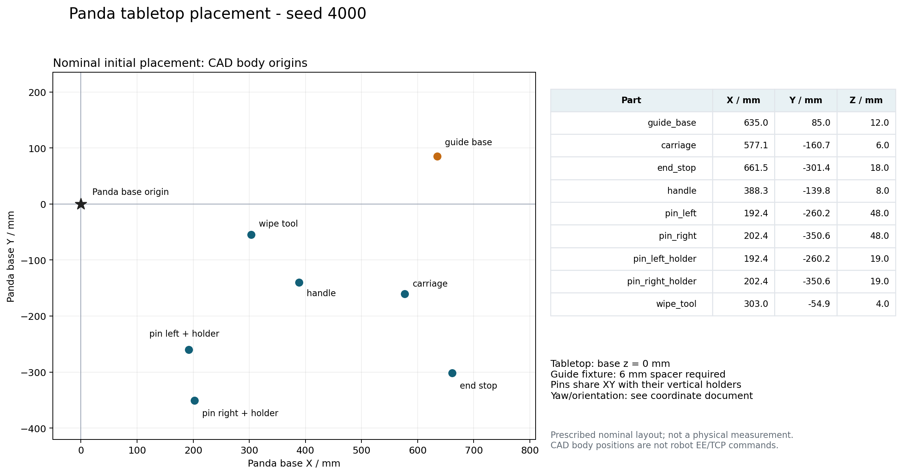

# Panda 真机零件摆放坐标与坐标定义（V34 接口）

以下是冻结 V33 的第一个预声明测试布局 `seed=4000` 对应的**名义摆放方案**，由原始布局、CAD 与 Panda 模型计算；不是相机测得的真机位姿。单位在 JSON 中为米，本文表格为毫米。机器人的底座直接安装在桌面，桌面作为底座坐标系 `z=0`。真机坐标轴必须采用实际 Panda 原生底座轴；`+Z` 向上，`+X/+Y` 与机器人自身轴一致，不能自行按相机画面重新定义。

可机读配置：[`real_robot/config/nominal_layout_4000.json`](../real_robot/config/nominal_layout_4000.json)。`measured=false` 必须保留到实际测量完成。该文件提供名义初始关节、各物体、夹具、桌面和目标参考，便于复现或建立数字孪生。



可打印图：[`panda_layout_4000.pdf`](panda_layout_4000.pdf)。俯视图标记 CAD body 原点；图形不表示零件外形或机械臂运动路线。

## 坐标换算与夹具高度

原冻结仿真的 Panda 底座在世界坐标 `(-0.560, 0, 0.800)`，姿态为单位旋转。因此：

```text
p_base = p_twin_world + (0.560, 0, -0.800)
T_twin_world_base = [[1,0,0,-0.560], [0,1,0,0], [0,0,1,0.800], [0,0,0,1]]
```

原实验固定导轨底座的 body 原点在桌面上方 12 mm；CAD 底面位于 body 原点下方 6 mm，故底座的实体底面在桌面上方 **6 mm**。复现原布局需要 6 mm 的被动垫块/装配定位座，并固定底座。如果实体底座直接放桌面，body 原点应为 `z=6 mm`，装配目标全部降低 6 mm；必须将实际夹具位姿输入孪生重新规划验证。机器人放桌面与导轨底座垫高是两个独立条件。

## 初始零件摆放

表格的 XYZ 指**运行时 CAD body 原点**，不是零件质心，不是 STL 打印坐标零点，也不是机器人末端 TCP。摆放时先在桌面上标出该原点的 XY 投影，再按实际 CAD 底面/定位特征对齐。偏航角为围绕底座 `+Z` 的右手旋转。

| 零件 | X / mm | Y / mm | body Z / mm | 偏航 / 度 | 实际摆放说明 |
|---|---:|---:|---:|---:|---|
| `guide_base` 导轨底座 | 635.000 | 85.000 | 12.000 | 0.000 | 实体底面 z=6 mm；固定在 6 mm 垫块/定位座上 |
| `carriage` 滑块 | 577.138 | -160.718 | 6.000 | -7.409 | 底面 z=0；抬高的抓取柱朝上 |
| `end_stop` 端挡 | 661.456 | -301.403 | 18.000 | 12.318 | 底面 z=0；两孔竖直，抓取凸台朝上 |
| `handle` 手柄环 | 388.341 | -139.786 | 8.000 | 12.619 | 平放桌面，孔轴向 +Z |
| `pin_left` 左销钉 | 192.442 | -260.179 | 48.000 | -18.070 | 在左供料座中竖直，头朝上；CAD 最低点 z=0 |
| `pin_right` 右销钉 | 202.435 | -350.630 | 48.000 | -16.723 | 在右供料座中竖直，头朝上；CAD 最低点 z=0 |
| `pin_left_holder` 左供料座 | 192.442 | -260.179 | 19.000 | -18.070 | 底面 z=0，与左销钉同轴 |
| `pin_right_holder` 右供料座 | 202.435 | -350.630 | 19.000 | -16.723 | 底面 z=0，与右销钉同轴 |
| `wipe_tool` 擦拭工具 | 302.996 | -54.907 | 4.000 | 5.679 | 使用 CAD 要求的 8 mm 海绵垫；海绵底面 z=0 |

导轨是 `guide_base` CAD 的一部分，不是另一件待机器人抓取的零件。该版本的 V33 冻结测试从“已清洁”条件开始，只测完整装配；擦拭工具作为场景物体保留，但上述装配流程不等于验证了真机清洁。

原始场景 XML 在自由物体 Z 上加入有限下落间隙并进行重力沉降，且仿真接触/海绵可能有微小压缩。上表按 CAD 静态支撑恢复名义 Z，没有把这些微小仿真穿透或初始化间隙当作物理摆放指令。

## 装配目标与可识别特征

| 特征/零件 | X / mm | Y / mm | Z / mm | 参考定义 |
|---|---:|---:|---:|---|
| 滑块装配 body 原点 | 665.000 | 85.000 | 24.000 | 目标偏航 0°；从导轨入口沿 +X 推入 |
| 导轨入口滑块 body 原点 | 480.000 | 85.000 | 24.000 | 入口中心，非末端位置 |
| 导轨入口上方滑块 body 原点 | 480.000 | 85.000 | 54.000 | 名义入口接近参考 |
| 端挡装配 body 原点 | 543.000 | 85.000 | 36.000 | 目标偏航 0°；实体底面 z=18 mm |
| 左销孔端挡上入口 | 543.000 | 53.000 | 54.000 | 孔轴沿 Z；插入沿 -Z |
| 右销孔端挡上入口 | 543.000 | 117.000 | 54.000 | 孔轴沿 Z；插入沿 -Z |
| 左销孔底座入口 | 543.000 | 53.000 | 18.000 | 底座板上表面 |
| 右销孔底座入口 | 543.000 | 117.000 | 18.000 | 底座板上表面 |
| 左销最小桥接 body 原点 | 543.000 | 53.000 | 59.000 | 42 mm 总插深参考；不是完整头部贴合 |
| 右销最小桥接 body 原点 | 543.000 | 117.000 | 59.000 | 42 mm 总插深参考；不是完整头部贴合 |
| 左销头部完全贴合 body 原点 | 543.000 | 53.000 | 55.000 | 理想 CAD 46 mm 总插深参考 |
| 右销头部完全贴合 body 原点 | 543.000 | 117.000 | 55.000 | 理想 CAD 46 mm 总插深参考 |
| 手柄环装配 body 原点 | 665.000 | 85.000 | 72.000 | 环中心；需重新测量已装配滑块柱位置 |

销钉 body 下端几何界限为 `-48 mm`，控制/验收中的轴尖参考为 `-47 mm`；头部下表面为 `-1 mm`。所以 `z=59 mm` 时轴尖在 `z=12 mm`，从端挡入口 `54 mm` 算总插深 42 mm。头部完全贴合时 body 应为 `55 mm`，轴尖 `8 mm`，总插深 46 mm。运行时实际释放高度取决于夹持和夹爪与端挡之间的避碰，不可把任一 Z 直接作为开环下压终点。端挡和底座的孔必须实测已同轴，再进入销钉动作。

## CAD 原点、尺寸与抓取参考

| 零件 | CAD 包围盒尺寸 / mm | body 最低 Z / mm | 默认抓取点相对 body 的 Z / mm | 默认夹持宽度 / mm |
|---|---|---:|---:|---:|
| 导轨底座 | 236 × 100.46 × 34 | -6 | — | — |
| 滑块 | 54 × 46 × 68 | -6 | +27 | 28 或 44，取决于抓取面 |
| 端挡 | 24 × 86 × 49 | -18 | +23 | 26 或 22，取决于抓取面 |
| 手柄环 | 42 × 41.9953 × 16 | -8 | 0 | 42 |
| 每枚销钉 | 18 × 17.998 × 61 | -48 | +6 | 18 |
| 每个销钉供料座 | 20 × 19.9978 × 38 | -19 | — | — |
| 擦拭工具刚体 | 36 × 28 × 65 | +4 | +47 | 28 |

销钉打印 STL 是头向下的打印朝向。运行时先绕 X 旋转 180°，再在 Z 平移 +13 mm，才得到头朝上的 body 几何；不能用 STL 的 Z 零点直接充当运行时销钉 body 原点。其他零件 STL 到 body 的 Z 平移分别为底座/滑块 -6 mm、端挡 -18 mm、手柄 -8 mm、供料座 -19 mm、擦拭刚体 +4 mm。擦拭工具额外的海绵不在 STL 内。

默认抓取参考是技能库中 `grip_site` 的位置。真实候选还会选择抓取高度偏移、偏航、XY 偏移和宽度；不能把默认抓取参考替代已筛选候选的实际抓取方案。V33 仿真 `grip_site` 位于手爪框架沿局部 +Z 97 mm；手爪框架相对手部还有固定旋转。真机 `panda_py.get_pose()` 所用 FCI EE 框架与 `grip_site` 的变换必须实测/核对后填入控制配置。

仿真俯抓的 `grip_site` 姿态由 `Rz(yaw) @ [[0,1,0],[1,0,0],[0,0,-1]]` 定义。实际 TCP 位姿应由同一候选的抓取变换与真实末端/TCP 变换共同计算，不能只把 body 坐标输入 `move_to_pose()`。

## 真机前需要填写的实际输入

1. 用实际 Panda 原生底座坐标确认桌面高度、导轨底座安装位姿、所有初始零件 body 位姿及不确定度；记录供料座与销钉同轴关系。JSON 中的 `measured` 与 `robot.state_measured` 分别表示场景和机器人初始状态实测。
2. 读取真实初始 7 关节角与夹爪开口，以及 FCI EE → 仿真抓取 TCP 的标定变换。原仿真 `HOME=[0,-0.55,0,-2.25,0,1.70,0.7854]` 只可作名义配置。
3. 实测 CAD 对应的打印尺寸/质量，接触材料、夹爪指尖形状、摩擦/刚度、外力读数和驱动控制接口；名义仿真材料参数不等于硬件材料标定。
4. 以这份实测输入重新生成候选、价值 Top3 排序和孪生精验。孪生通过后由硬件端重新检查当前状态及 receiver 登记；运行中保留力限、超时、夹持/装配状态反馈。

已有 V33 `result.json` 记录原子调用和部分路径/局部接触轨迹，未保存完整可直接发送到真机的控制轨迹；演示视频也明确重新执行仿真获取画面。可在新的实测场景中给 `ctx.on_control_step` 增加采样，记录七关节及 `grip_site` 位姿用于审阅，但接触插入应由真机反馈控制，而不是机械重播仿真关节序列。

来源：冻结 `results/v33_test_top3_20260927/seed_4000/request.json`、对应 `planning/geometry_manifest.json`、`simbench/assets/panda/panda.xml`、`simbench/assembly/printed_kit.py`、`library.py` 和 `control.py`。V34 接口文件与坐标说明没有修改 V33 的冻结物理代码或已有实验结果。
