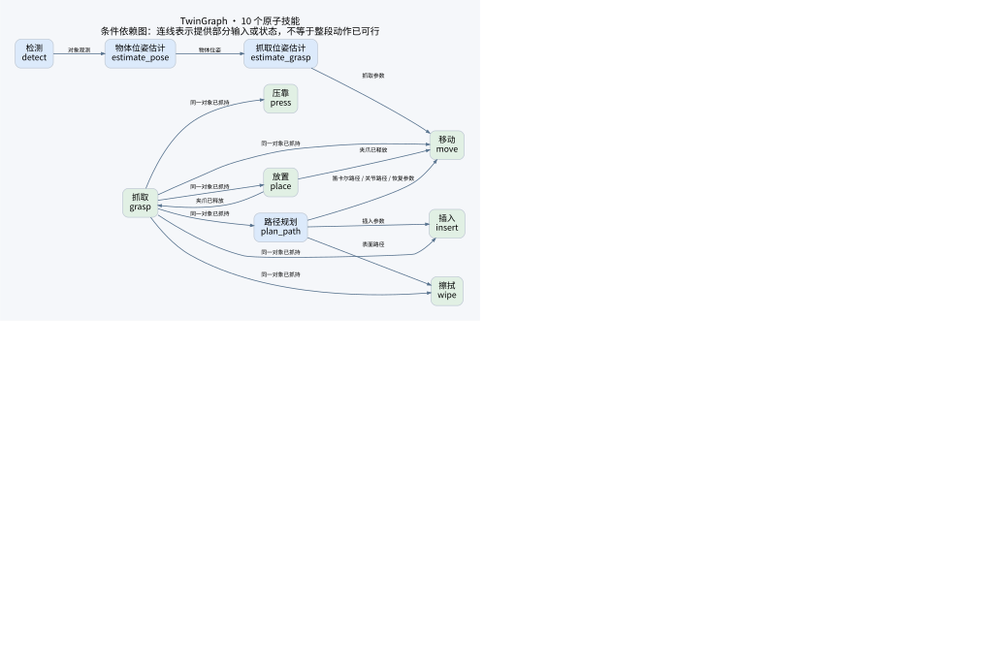

# 当前 10 个原子技能图谱

[PNG](skill_graph.png) · [完整机器可读契约](skill_graph.json)

图中蓝色是输出信息的原子技能，绿色是执行原子技能。所有 14 条边都从 `HANDLERS` 中的前置条件、状态效果和输出类型推导；测量、验收和候选模板不作为额外技能节点。

**这是条件依赖图，不是逐步执行流程图。** 例如抓取到插入的边只提供“持有同一对象”，还需要路径规划提供绑定的插入参数，且必须先通过移动到达合适姿态。图中未画“移动到抓取”的时序箭头，因为单纯到达某位置不声明抓取一定可行；真实接触与几何仍由控制与孪生验证。

| 情况 | 验证结果 | 后续处理 |
|---|---|---|
| 工具不具有擦拭能力，或路径绑定到别的对象 | `conflict` | 排除此绑定方案 |
| 类型、对象、夹爪资源满足，但路径尚待生成或接触未知 | `unknown` 且必要检查通过 | 保留候选，继续求解或孪生验证 |
| 所声明的必要条件均检查完，没有剩余未知项 | `necessary_pass` | 仅在当前检查范围内通过 |

擦拭的实际调用次序为：检测 → 位姿估计 → 抓取位姿估计 → 路径规划 → 移动到抓取位姿 → 抓取 → 表面路径规划 → 移动到表面起点 → 擦拭 → 移动到归还位置 → 压靠 → 放置。这里的多个“移动”和“路径规划”是同一节点的不同实例。

`wipe` 与 `plan_path(method="surface")` 共同检查工具的 `wipe` 能力；路径保留对象、抓法身份和抓持时刻绑定。`validate_skeleton()` 与 `Session.call()` 调用同一契约解释器，真实执行额外读取双侧抓持接触。不能因为图上有线就删除所有几何或接触未知的候选。

复现：`python -m simbench.assembly.graph_figure --out docs/skill-graph`。图形生成需要 Graphviz，图数据生成不需要。
