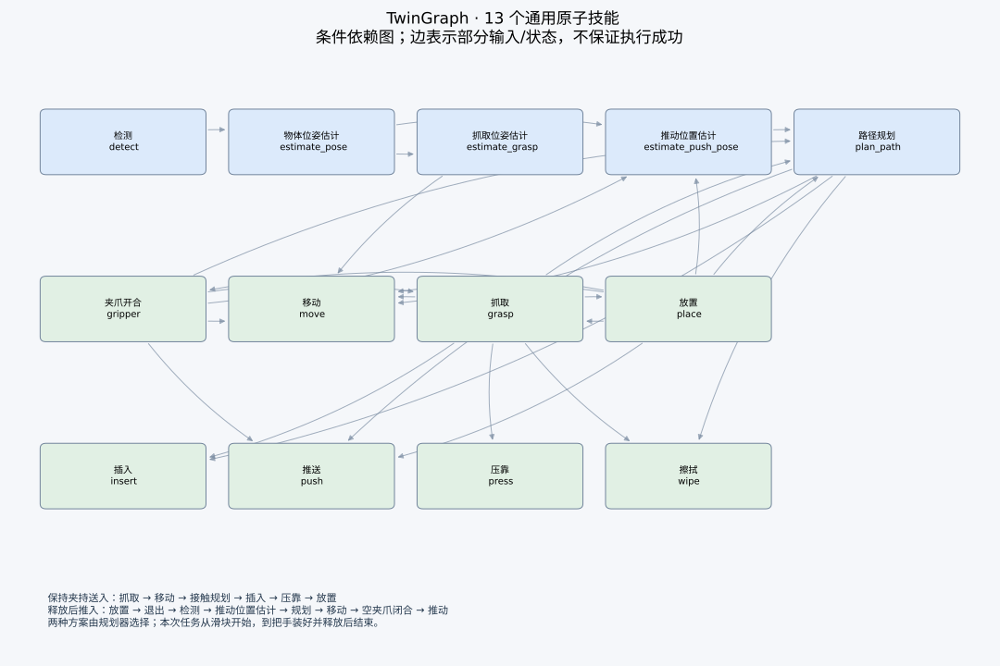

# 当前 13 个通用原子技能

[PNG](skill_graph.png) · [完整机器可读契约](skill_graph.json)

13 个公开节点和 26 条条件依赖边均来自执行器使用的同一注册表。蓝色节点输出信息，绿色节点执行动作；测量、验收和候选模板不额外计为技能。

新增推动位姿估计、推动规划、空夹爪闭合和真实接触推动接口。推动必须由观测位姿和几何估计接触点，经规划、移动到位后执行，并记录实际接触力与物体位移。夹爪闭合本身不声明已经抓住对象。

本次任务从滑块开始，到把手装好、释放和退回后结束。规划器可以选择保持夹持送入，也可以选择放下后推入；两种方案均由通用原子调用组合，选择发生在仿真结果产生之前。擦拭仍是通用库技能，本次任务不调用它。

图上的边只表达部分输入和状态依赖。例如“抓取 → 插入”提供持有同一对象的条件，还需要路径规划和到位检查。必要条件通过不保证物理成功，未知接触仍需孪生执行验证。静态检查和真实执行使用同一套契约。

复现：`python -m scripts.export_skill_graph_v32`。导出 UTF-8 JSON、SVG 和 PNG，不依赖 Graphviz。
