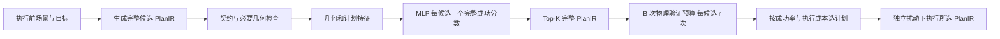

# 两家族价值筛选研究原型：运行说明

本版本使用原有 MuJoCo/PyTorch 环境，不需要重训原子技能。正式结果见根目录 `NEXT_ROUND_REPORT.md`；v1 数据与模型保持原样。

## 输入与输出

输入是执行前场景（物体位姿、几何、机器人状态、目标）和一批合法但连续执行效果尚未知的 PlanIR。对象名称仅用于绑定。候选生成器确定抓取区域/方向、真实路线、力、下降速度和合法装配顺序；模型不凭空生成动作。

每个候选只输出一个整段任务分数，按分数返回完整 Top-K PlanIR。单头表示一个完整成功目标；这里的几何先验加残差仍在预测同一目标，不是“前缀头 × 后缀头”。输出分数未经可靠概率校准，不作为保证。

几何规则在名义终态检查夹爪释放空间，包括此前装入的零件。它不调用物理执行。轻量 MLP 与残差模型读取相同几何/计划数值特征；Transformer 读取有类型的完整计划，视觉版本另读冻结 ResNet18 特征。完整几何排序代理只由需要它的方法计算，必要路线检查始终保留。



例如 N=32、K=4、B=8、r=2：模型先对 32 个真实候选评分，B 模式只验证前四个，每个两次；选中后再单独执行。训练时则让候选真实执行，记录完整任务成功/失败，用这些历史标签拟合模型。运行时评分器不读取这些后续标签。

## 环境与执行

服务器已有解释器：

```bash
cd /root/rivermind-data/twingraph
export PYTHONPATH=. MUJOCO_GL=egl OMP_NUM_THREADS=1 OPENBLAS_NUM_THREADS=1
PY=/root/rivermind-data/twingraph-venv/bin/python
$PY -m pytest simbench/tests -q
```

创建新配置并执行实际被选中的计划：

```bash
$PY -m simbench.value.research_decision \
  --checkpoint models/value/best_value_v2.pt \
  --out results/my_connector --family rigid_connector_module --seed 30000 \
  --n 32 --k 4 --budget 8 --repeats 2 --mode best_within_budget
```

`first_verified` 找到首个满足验证标准的候选就停止；`best_within_budget` 用相同重复数比较候选，按成功率、成功时仿真耗时、原排名择优。默认 r=2、接受率=0.5。K 是首批候选数，B 是物理 rollout 数；重复 r 次消耗 r 个预算。默认不扩展，只有显式 `--allow-expand` 才访问 Top-K 之外。

输出含 `inputs.json`、`top_k.json`、`decision.json`、步骤日志和场景 XML。最后的部署试验使用独立扰动重新执行选中 PlanIR；它仍是仿真部署。

只对已有不可变数据文件排序（需要匹配的 `geometry.json` 或视觉缓存；不读取 outcomes）：

```bash
$PY -m simbench.value.research_rank \
  --checkpoint models/value/best_value_v2.pt \
  --input results/value_v2/data/group_rigid_connector_module_20040_0/inputs.json \
  --out results/top_k.json --k 4 --device cuda
```

这个离线排序入口的耗时不包含物理规划，不用于端到端加速论断。

## 重现采集、训练与正式比较

```bash
$PY scripts/run_value_v2_collection.py --workers 6
bash scripts/train_value_v2.sh
$PY scripts/run_value_v2_collection.py --test --workers 6
$PY -m simbench.value.vision --data results/value_v2/data --device cuda
$PY scripts/prepare_value_v2_models.py --v1 models/value/plan_value_direct_v1.pt
$PY -m simbench.value.research_evaluate   --models results/value_v2/models/all_models.json   --data results/value_v2/data --out results/value_v2/locked_metrics.json
$PY scripts/run_value_v2_online.py --workers 6
$PY scripts/run_value_v2_curves.py --workers 4
$PY scripts/summarize_value_v2.py
$PY scripts/audit_value_v2_table.py
$PY scripts/plot_value_v2.py
```

绘图是独立的分析步骤，需要 Matplotlib；本轮服务器训练环境没有该库，因此在本地已有分析环境运行同一 `plot_value_v2.py`，没有改动服务器的 Torch/CUDA 环境。`plot_manifest.json` 同时记录指标内容和图像文件的哈希。把本轮指标同步到 `docs/evidence/value_v2` 后，可用以下命令重画：

```bash
python scripts/plot_value_v2.py --root docs/evidence/value_v2 --out docs/evidence/value_v2
```

将生成的图表及 manifest 同步回服务器后，可继续发布检查而不重做物理试验：

```bash
$PY scripts/finish_value_v2_release.py \
  --code-commit 304f6e0a3b9084eac195e1e57ef1acc07d64750b \
  --package-only --prepared-plots
```

它会核对图表对应的指标和图像哈希，再执行回归、冷启动测量与打包。上述 commit 是本轮运行时实现冻结点；精确源码字节以发布的 source hash 清单为准。

精确复现本轮训练时，先将发布数据归档解压到 `results/value_v2/data`，其中还包含早期完成并保留的宽接口开发数据和显式源码兼容清单。仅从当前采集器重新生成，会得到紧凑/宽间距混合的 v2b 分布，不会自动重建 v2a 宽接口增强部分。两份采集源码均随发布保存。

旧配置完整标记可断点续跑。改变采集参数/分布时使用新的输出目录，不把旧 complete 标记当成新采集结果。测试种子已经公开并评估，后续方法开发应使用新的预先锁定测试集，而不是反复调参追逐这一份测试。

## 扩展与边界

- 池大小 16/32/64 使用同一固定随机排列的嵌套前缀；去重比较实际参数与结构。
- `--checkpoint-stage 1/2/3` 从真实机器人执行后的状态构建剩余任务；不把零件传送到中间目标。
- `scripts/probe_value_v2_order.py` 可重现固定每件抓法、只交换两个插芯顺序的开发配对试验。
- `simbench.value.research_checks` 记录速度、力、路线与抓法的实际轨迹影响。
- 大池在线曲线没有完整 32/64 池的独立参考标签，只报告实际部署与成本，不报告完整池 Regret。
- 感知使用仿真器提供的精确几何/位姿，接触模型继承当前 Panda 资产；本轮不构成感知鲁棒性或真实机器人验证。
