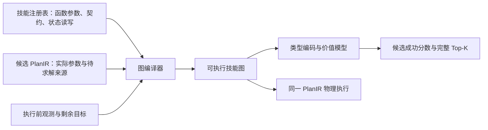

# 价值模块 v3：让可执行技能图直接提供输入

## 这次改变了什么

旧版有两条独立的信息整理路径：执行器调用技能，价值模型另外提取 87 维
数值摘要。本版新增统一输入路径，原版保留为对照与回归：

图节点是一次**实际技能调用**。`move` 可以重复出现；感知、规划、执行和
验收调用均保留。每张图内保存唯一一份可执行 PlanIR，修改参数、依赖边或
技能接口后必须重新编译。数据依赖边不能用于跳过中间步骤。

## 输入为什么包括这些参数

不是为滑台重新挑选一组特征。`assembly/library.py` 中注册的实际技能函数
给出参数名和默认值，`assembly/ports.py` 声明控制接口的数据类型、单位和
状态读写。执行分发器和图编译器共用这些声明。

| 图中数据 | 来源 | 执行含义 |
|---|---|---|
| `estimate_grasp.height_offset`、`yaws` | 抓法生成接口 | 抓取位置与方向 |
| `grasp.force` | 闭爪控制接口 | 实际夹持力 |
| `plan_path.clearance`、`target` | 路径规划接口 | 规划净空与目标 |
| `move.speed`、`target_z` | 运动／保护下降接口 | 运动速度与位置 |
| `place.target`、`tol`、`settle` | 放置接口 | 释放目标、容差与稳定时间 |
| 当前关节、物体位姿与几何 | 现有仿真观测接口 | 技能读取的执行前场景 |
| 目标位置与验收谓词 | 原任务目标 | 这次计划要完成什么 |

物体名称仅用于绑定到相应观测，网络读入的是绑定对象的属性。候选编号、
资产名称、成功标签、失败日志及未来实测位姿不作为网络输入。当前实验采用
仿真位姿和几何观测，没有新加视觉编码器，也不把“释放难度”作为人工输入。

例如，后续搬运目标含 `object_to_eef` 待求解引用：图保留名义目标和来源，
不把尚未执行的抓持变换伪装成已知值。未知、待求解与数值零分别编码。

## 图里的边是什么

1. **执行相邻**：必须按 PlanIR 调用顺序运行。
2. **数据来源**：路径消费规划输出、接近消费选定抓法。
3. **状态来源**：物体、抓持关系、场景、机器人和观测各自带版本。

例如一次抓取产生的抓持关系会被搬运、压入和释放读取；安装一个物体后，
后续动作读取更新后的场景版本。这些边表示可能的影响，不证明动作可行，
也不是通过结果标签反推的因果标签。未来状态只有声明及来源，没有未来实测值。

当前状态读写是保守的接口声明，不是对 Python 控制器做完整的动态读写追踪。
它可能包含冗余依赖；这也是必须用正确边、去边和乱边对照检查的原因。

## 实际比较的模型

| 名称 | 输入整理与结构 | 是否计算几何排序代理 |
|---|---|---|
| 几何规则 | 原有释放空间代理 | 是 |
| MLP87 | 原 87 维几何／计划摘要 → 64 → 32 → 1 | 是 |
| 字段序列 Transformer | 原字段式 PlanIR 编码；64 维、2 层、4 头 | 否 |
| 端口集合 MLP | 从训练图自动生成端口词表；通用数值通道和计数 → 64 → 32 → 1 | 否 |
| 图接口序列模型 | 类型化端口 → 调用级注意力汇聚 → 64 维、2 层、4 头 Transformer | 否 |
| 状态依赖图模型 | 与上一行完全相同，增加 7 类依赖及反向关系的可学习注意力偏置 | 否 |

所有学习模型最终都是**单头**：输出整段后缀完成的一个 logit，再用 sigmoid
得到分数。不是每条边给一个概率再相乘，也没有强制增加前缀成功头。

图模型先对每个端口的名称、类型、单位、状态和值进行共享编码；归一化统计
只由训练输入拟合。随后在一次调用内汇聚，再在调用与上下文之间交换信息。
关系偏置不封锁全局注意力，避免漏掉未显式声明的物理相互影响。

端口集合 MLP 的列名由图字段自动生成，训练标签不参与建词表。它是简单强对照，
会丢失精确执行顺序，不能代替图模型承担未见顺序组合泛化的结论。未见字段不会
凭空生成已训练权重；新增接口或完全不同技能组合需重新检查覆盖率和适配。

## 输出是什么

`GraphScorer.rank(graphs, k=4)` 返回每个候选的预测分数、完整排序、Top-K
PlanIR、Top-K 完整技能图、checkpoint／图哈希和模块各阶段耗时。输出的 PlanIR
直接进入原物理执行器，执行器再次检查图与 PlanIR 的一致性。

`Hit@K` 表示 Top-K 中**至少有一个**候选达到候选池经验最佳质量附近，不表示
K 个都成功。另报 Top-K 平均经验成功率、可行命中和 regret。只有两次重复的
经验率非常粗，独立部署试验用另外的扰动，不能用筛选时的成功标签代替执行。

## 与 PIGINet 的关系及当前边界

[PIGINet](https://roboticsproceedings.org/rss19/p061.html) 已经把计划、图像、目标和
初始状态输入 Transformer，并用可行性预测减少后续求解时间。本版借鉴类型化
融合和计划级评分；没有复现其 CLIP／厨房任务，也不把 Transformer 本身当创新。
可检验的改动是：输入和依赖来自执行使用的接口，而不是另一套价值模型特征定义。

第一轮物理数据仍是滑台**销安装后缀**，每个计划 19 次调用。多对象和变长有
接口／张量测试，但本轮没有用这些测试冒充完整滑台装配或未见长度物理泛化。
图 v1 支持显式 program PlanIR；旧前缀载荷保留旧评分器兼容。仅有候选 ID、
却没有物化选中数据的外部选择，会被拒绝，避免忽略实际分支差异。

最终数值见 `VALUE_GRAPH_REPORT.md`，复现实验定义见 `value-v3-protocol.md`。
