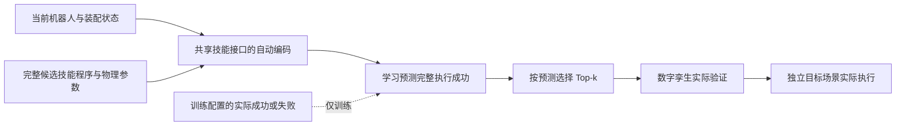

# 价值模块 v5：状态与可执行技能程序

外部接口只有 `ValueScorer(checkpoint).rank(state, plans, k)`。`state` 含当前机器人状态、对象几何与位姿、装配目标；`plans` 是原子技能库同一套接口生成的有序可执行程序。每个调用保留参数类型、单位、坐标系、数值、前后条件和数据依赖。已经生成的关节轨迹保留全部路点；依赖抓持反馈的后续轨迹明确标为待求解，不能把尚不存在的未来轨迹称为已规划轨迹。

模型与原子技能图谱统一在**可执行接口和数据契约**上，而不要求采用图神经网络。现有图谱编译器提供接口校验与引用解析；模型读取其规范化的状态及有序调用记录，不进行图消息传递。对象按程序引用规范编号，去除候选编号等无关标识。输入编码器遍历全部声明端口与 robot/object/goal 状态，用训练输入建立字段词表，对数值作训练集标准化。字段不是人工挑选的87项，也不把手工评分拟合作为标签。

当前模型是小型 MLP，另设线性对照；MLP 本身并非问题，人工限定业务特征才是此前接口不统一的原因。为控制输入规模，只根据训练输入移除完全不变和完全重复的列。完整原始程序始终保存，并在推理时记录未知字段、已删除常量的变化和重复关系破坏。该压缩是可审计的任务内实现选择，**没有被证明为最优或跨任务信息无损**。换任务或引入未见调用结构时需要重新拟合编码器和模型。

这里的 `state` 是现有任务观测接口，不等于完整仿真器状态：它包含关节、夹爪、末端位置、零件位姿及 CAD 物理属性和目标，但不包含速度、接触历史或逐次变化的机器人动力学参数。当前验证范围是固定机器人、近静止供料初态。字段变化诊断会随评分返回，不会自动补回已删除列；不能据此宣称新程序结构已获得支持。

监督目标为同一候选在数字孪生中的实际完整执行成功/失败。成功由原有技能契约及全部五部件的装配终验决定；位置、接触力等任务验收阈值属于装配规范，不是拼接成奖励的评分权重。训练采用二元交叉熵；模型、轮次、分类阈值只使用训练/验证配置确定。Top-k 使用原始 logit 排序，之后仍由数字孪生验证。

可以将模块写为 `Vθ(s, π; Σ) = sigmoid(fθ(EΣ(s, π)))`，其中 `Σ` 是现有技能接口，`EΣ` 是按接口自动编码当前状态与完整候选程序。标签 `y` 是程序实际执行并通过任务终验的二值结果。损失为各配置等权的平均二元交叉熵：每个配置内再对其全部候选取平均。因此无需设计“距离×权重＋力×权重＋时间×权重”的训练分数。

选择成功预测值作为粗筛依据有明确目标：若预测等于真实条件成功概率，按概率选 Top-k 能最大化所保留候选的**期望成功数量**，这一结论不要求候选之间独立。但它不保证“至少一条成功”的概率最优，也不保证变动仿真成本下的时间最优；相似候选的失败可能相关。因此实验同时报告分类、Top-k 命中率、成功方案比例及实际计时，而不将其中一项等同于全部目标。训练得到的近似概率是否有用，仍由独立测试决定。

本轮不强制加入 RGB。当前实验直接获得已知 CAD 几何、位姿及机器人状态，图像不是控制接口缺失的必需信息。[PIGINet 原论文](https://arxiv.org/abs/2211.01576)研究从计划、初始状态和目标预测运动细化可行性，视觉表示服务于新对象泛化。这里首先验证已知滑台与仿真状态下的完整执行筛选；未进行图像消融，不能声称图像无用。若后续目标是遮挡、感知误差或未知零件，增加观测图像及不确定性有明确动机。

PIGINet 并非没有物理量输入：它编码初始物体位姿、关节角等连续状态；其被评分的高层计划省略连续动作参数。本模块则按执行端口接收已物化轨迹及力、速度等参数，并以完整执行成败监督。[论文方法说明](https://arxiv.org/html/2211.01576v2)支持这一范围区别，不构成两种方法性能优劣的实验比较。每个训练候选的标签来自一次名义执行，输出也不能直接解释为扰动条件下或真实硬件上的校准成功概率。

候选从真实供料布局、合法装配顺序、现有抓取估计、运动规划和小范围可执行控制参数组合产生。几何预检在独立临时状态中检查供料接近和名义装配位置的夹爪空间；不会把名义装配位置写入真正执行的初始状态。预检拒绝及求解未知均保留记录，禁止读取执行标签后拼凑正负样本。每个正式候选都实际运行，配置内的全部候选在同一数据划分中。

系统实验明确标注当前助手为 LLM 代理，保存输入技能目录、任务和符号提案。代理提供零件顺序及技能骨架；任务编译器展开实际调用，几何与运动求解器给出物理参数。价值筛选后在 twin 中验证，从通过者中选择，再在独立创建的 target 仿真场景执行。target 从五部件均未装配的供料状态开始；不复制 twin 的成功状态。它是实机的仿真替代，尚不是实机验证。

具体而言，本轮各配置复用已保存的代理提案，候选生成器实际消费 `proposed_orders`；`proposed_skill_programs` 仅作提案来源记录。完整 101 次调用由滑台任务的 `stage_calls` 模板展开，没有评估逐场景重新调用 LLM 或任意技能序列合成。系统计时也不含提前完成的代理提案生成耗时。
